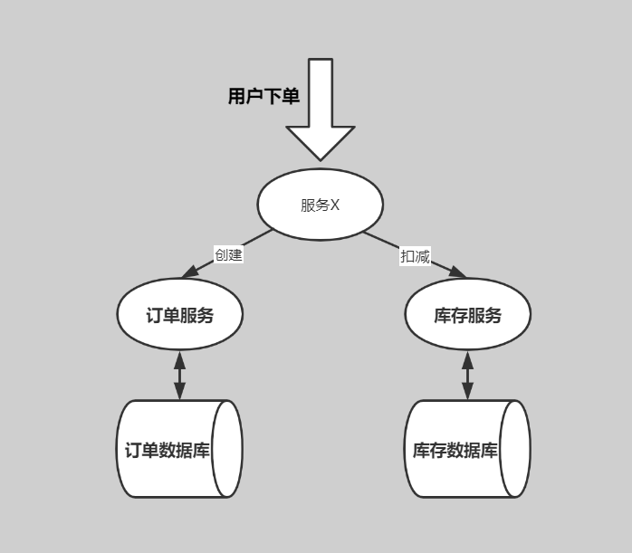
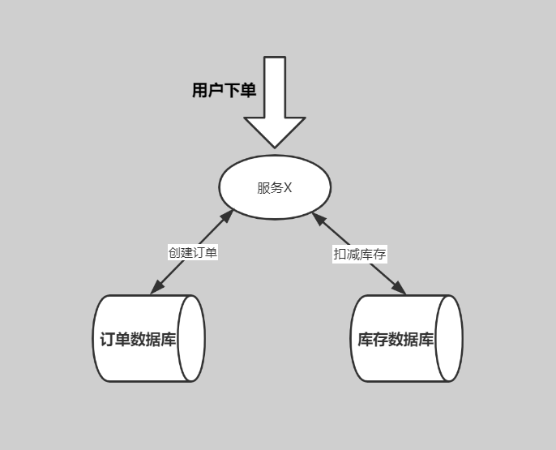
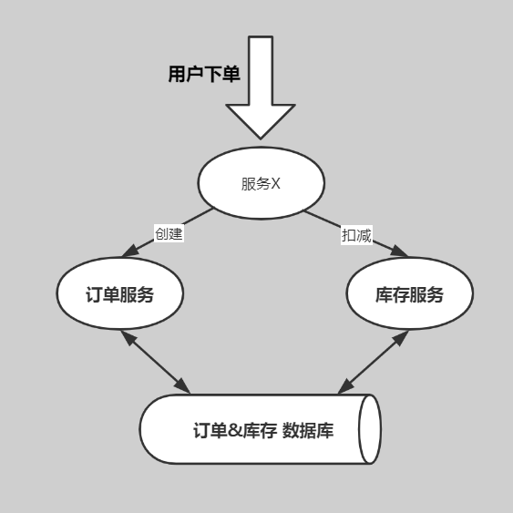

# 分布式事务是什么

在分布式系统中一次操作由多个系统协同完成，这种一次事务操作涉及多个系统通过网络协同完成的过程称为分布式事务。这里强调的是 **多个系统通过网络协同完成一个事务的过程** ，并不强调多个系统访问了不同的数据库，即使多个系统访问的是同一个数据库也是分布式事务。

上图所示，典型的场景就是微服务架构，微服务之间通过远程调用完成事务操作。比如 ：订单微服务和库存微服务，下单的同时订单微服务请求库存微服务减库存。简言之 ：跨JVM进程产生分布式事务。

上图所示为跨数据库实例产生分布式事务。

当单体系统需要访问多个数据库（实例）时就会产生分布式事务。比如：订单信息和库存信息分别在两个MySQL实例存储，用户下单需要分别去创建订单和扣减库存，由于数据分布在不同的数据实例，需要通过不同的数据库链接去操作数据，此时产生分布式事务。简言之 ：跨数据库实例产生分布式事务。

上图所示为多服务访问同一个数据库实例。

订单微服务和库存微服务即使访问同一个数据库也会产生分布式事务，原因就是跨JVM进程，两个微服务持有了不同的数据库链接进行数据库操作，此时产生分布式事务。