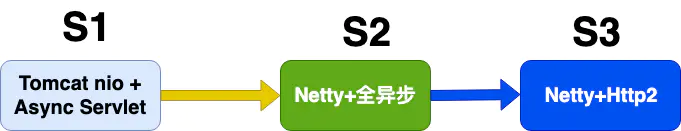
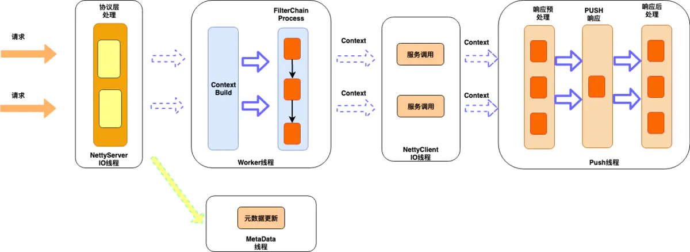
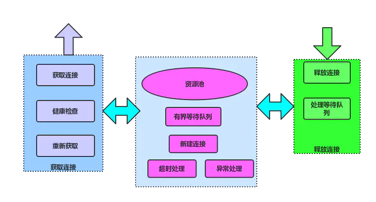
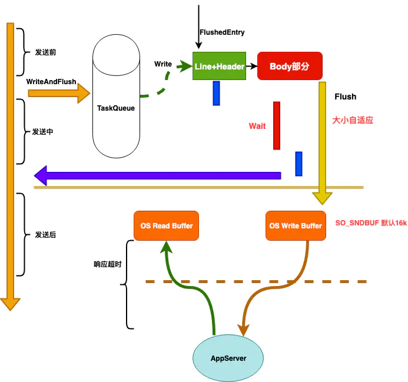
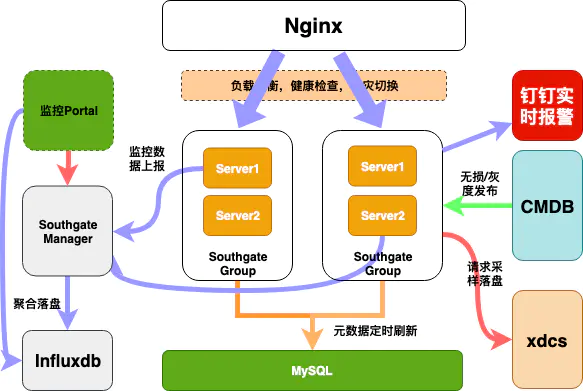
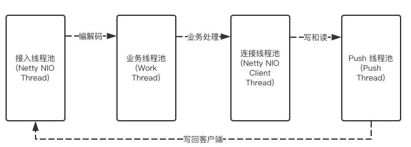

# 喜马拉雅自研网关架构实践

<!-- TOC -->

- [喜马拉雅自研网关架构实践](#喜马拉雅自研网关架构实践)
  - [背景](#背景)
  - [第一版 Tomcat nio + AsyncServlet](#第一版-tomcat-nio--asyncservlet)
  - [第二版 Netty + 全异步](#第二版-netty--全异步)
    - [接入层](#接入层)
    - [业务逻辑层](#业务逻辑层)
    - [服务调用层](#服务调用层)
    - [异步Push](#异步push)
    - [链接池](#链接池)
    - [Connection:close](#connectionclose)
    - [写超时](#写超时)
    - [全链路超时机制](#全链路超时机制)
  - [监控报警](#监控报警)
  - [协议层](#协议层)
  - [应用层](#应用层)
  - [总体架构](#总体架构)
  - [性能优化实践](#性能优化实践)
    - [对象池技术](#对象池技术)
    - [上下文切换](#上下文切换)
    - [GC优化](#gc优化)
    - [日志](#日志)
  - [未来规划](#未来规划)
  - [总结](#总结)

<!-- /TOC -->

## 背景

网关是一个比较成熟了的产品，基本上各大互联网公司都会有网关这个中间件，来解决一些公有业务的上浮，而且能快速的更新迭代，如果没有网关，要更新一个公有特性，就要推动所有业务方都更新和发布，那是效率极低的事，有网关后，这一切都变得不是问题，喜马拉雅也是一样，用户数增长达到6亿多的级别，Web服务个数达到500+，目前我们网关日处理200亿加次调用，单机QPS高峰达到4w+。

网关除了要实现最基本的功能反向代理外，还有公有特性，比如黑白名单，流控，鉴权，熔断，API发布，监控和报警等，我们还根据业务方的需求实现了流量调度，流量Copy，预发布，智能化升降级，流量预热等相关功能，下面就我们网关在这些方便的一些实践经验以及发展历程，下面是喜马拉雅网关的演化过程：


## 第一版 Tomcat nio + AsyncServlet

网关在架构设计时最为关键点，就是网关在接收到请求，调用后端服务时不能阻塞Block，否则网关的吞吐量很难上去，因为最耗时的就是调用后端服务这个远程调用过程，如果这里是阻塞的，那你的tomcat的工作线程都block主了，在等待后端服务响应的过程中，不能去处理其他的请求,这个地方一定要异步

架构图如下：




这版我们实现单独的Push层，作为网关收到响应后，响应客户端时，通过这层实现，和后端服务的通信是HttpNioClient，对业务的支持黑白名单，流控，鉴权，API发布等功能，这版只是功能上达到网关的邀请，但是处理能力很快就成了瓶颈，单机qps到5k的时候，就会不停的full gc，后面通过dump 线上的堆分析，发现全是tomcat缓存了很多http的请求，因为tomcat默认会缓存200个requestProcessor，每个prcessor都关联了一个request，还有就是servlet3.0 tomcat的异步实现会出现内存泄漏，后面通过减少这个配置，效果明显。但性能肯定就下降了，总结了下，基于tomcat做为接入端，有如下几个问题：

Tomcat自身的问题

- 缓存太多，tomcat用了很多对象池技术，内存有限的情况下，流量一高很容易触发gc。
- 内存copy，tomcat的默认是用堆内存，所以数据需要读到堆内，而我们后端服务是netty，有堆外内存，需要通过数次copy。
- tomcat 还有个问题是读body是阻塞的,tomcat 的nio模型和reactor模型不一样，读body是block的。

HttpNioClient的问题
- 获取和释放链接都需要加锁，对应网关这样的代理服务场景，会频繁的建链和关闭链接，势必会影响性能。

基于tomcat的存在的这些问题，我们后面对接入端做改造，用Netty做接入层和服务调用层，也就是我们的第二版，能彻底解决上面的问题，达到理想的性能。


## 第二版 Netty + 全异步

> 基于Netty的优势，我们实现了全异步，无锁，分层的架构

先看下我们基于Netty做接入端的架构图



### 接入层

> Netty的io线程，负责http协议的编解码工作，同时对协议层面的异常做监控报警

对http协议的编解码做了优化，对异常，攻击性请求监控可视化，比如我们对http的请求行和请求头大小是有限制的，tomcat是请求行和请求加在一起，不超过8k，netty是分别有大小限制，假如客户端发送了超过阀值的请求，带cookie的请求很容易超过，正常情况下，netty就直接响应400给客户端，经过改造后，我们只取正常大小的部分，同时标记协议解析失败，到业务层后，就可以判断出是那个服务出现这类问题，其他的一些攻击性的请求，比如只发请求头，不发body/或者发部分这些都需要监控和报警。

### 业务逻辑层

负责对API路由，流量调度等一序列的支持业务的公有逻辑，都在这层实现，采样责任链模式，这层不会有io操作。

在业界和一些大厂的网关设计中，业务逻辑层基本都是设计成责任链模式，公有的业务逻辑也在这层实现，我们在这层也是相同的套路，支持了：

- 用户鉴权和登陆校验，支持接口级别配置
- 黑白明单，分全局和应用，以及ip维度，参数级别
- 流量控制，支持自动和手动，自动是对超大流量自动拦截，通过令牌桶算法实现
- 智能熔断，在histrix的基础上做了改进，支持自动升降级，我们是全部自动的，也支持手动配置立即熔断，就是发现服务异常比例达到阀值，就自动触发熔断
- 灰度发布，我对新启动的机器的流量支持类似tcp的慢启动机制，给机器一个预热的时间窗口
- 统一降级，我们对所有转发失败的请求都会找统一降级的逻辑，只要业务方配了降级规则，都会降级，我们对降级规则是支持到参数级别的，包含请求头里的值，是非常细粒度的，另外我们还会和varnish打通，支持varish的优雅降级
- 流量调度，支持业务根据筛选规则，对流量筛选到对应的机器，也支持只让筛选的流量访问这台机器，这在查问题/新功能发布验证时非常用，可以先通过小部分流量验证再大面积发布上线。
- 流量copy，我们支持对线上的原始请求根据规则copy一份，写入到mq或者其他的upstream，来做线上跨机房验证和压力测试。
- 请求日志采样，我们对所有的失败的请求都会采样落盘，提供业务方排查问题支持，也支持业务方根据规则进行个性化采样，我们采样了整个生命周期的数据，包含请求和响应相关的所有数据。


上面提到的这么多都是对流量的治理，我们每个功能都是一个filter，处理失败都不影响转发流程，而且所有的这些规则的元数据在网关启动时就会全部初始化好，在执行的过程中，不会有IO操作，目前有些设计会对多个filter做并发执行，由于我们的都是内存操作，开销并不大，所以我们目前并没有支持并发执行，还有个就是规则会修改，我们修改规则时，会通知网关服务，做实时刷新，我们对内部自己的这种元数据更新的请求，通过独立的线程处理，防止io在操作时影响业务线程。

### 服务调用层

服务调用对于代理网关服务是关键的地方，一定需要异步，我们通过netty实现,同时也很好的利用了netty提供的链接池，做到了获取和释放都是无锁操作

### 异步Push

网关在发起服务调用后，让工作线程继续处理其他的请求，而不需要等待服务端返回，这里的设计是我们为每个请求都会创建一个上下文，我们在发完请求后，把该请求的context 绑定到对应的链接上，等netty收到服务端响应时，就会在给链接上执行read操作，解码完后，再从给链接上获取对应的context，通过context可以获取到接入端的session，这样push就通过session把响应写回客户端了，这样设计也是基于http的链接是独占的，即链接可以和请求上下文绑定。

### 链接池

链接池的原理如下图：




服务调用层除了异步发起远程调用外，还需要对后端服务的链接进行管理，http不同于rpc，http的链接是独占的，所以在释放的时候要特别小心，一定要等服务端响应完了才能释放，还有就是链接关闭的处理也要小心，总结如下几点：

- Connection:close
- 空闲超时，关闭链接
- 读超时关闭链接
- 写超时，关闭链接
- Fin,Reset

上面几种需要关闭链接的场景，下面主要说下Connection:close和空闲写超时两种，其他的应该是比较常见的比如读超时，链接空闲超时，收到fin，reset码这几个。

### Connection:close

后端服务是tomcat，tomcat对链接重用的次数是有限制的，默认是100次，当达到100次后，tomcat会通过在响应头里添加Connection:close，让客户端关闭该链接，否则如果再用该链接发送的话，会出现400。

还有就是如果端上的请求带了connection:close,那tomcat就不等这个链接重用到100次，即一次就关闭，通过在响应头里添加Connection:close，即成了短链接，
这个在和tomcat保持长链接时，需要注意的，如果要利用，就要主动remove掉这个close头。

### 写超时

首先网关什么时候开始计算服务的超时时间，如果从调用writeAndFlush开始就计算，这其实是包含了netty对http的encode时间和从队列里把请求发出去即flush的时间，这样是对后端服务不公平的，所以需要在真正flush成功后开始计时，这样是和服务端最接近的，当然还包含了网络往返时间和内核协议栈处理的时间，这个不可避免，但基本不变。

所以我们是flush成功回调后开始启动超时任务，这里就有个注意的地方，如果flush不能快速回调，比如来了一个大的post请求，body部分比较大，而netty发送的时候第一次默认是发1k的大小，如果还没有发完，则增大发送的大小继续发，如果在netty在16次后还没有发送完成，则不会再继续发送，而是提交一个flushTask到任务队列，待下次执行到后再发送，这时flush回调的时间就比较大，导致这样的请求不能及时关闭，而且后端服务tomcat会一直阻塞在读body的地方，基于上面的分析，所以我们需要一个写超时，对大的body请求，通过写超时来及时关闭。

### 全链路超时机制

下面是我们在整个链路种一个超时处理的机制。



- 协议解析超时
- 等待队列超时
- 建链超时
- 等待链接超时
- 写前检查是否超时
- 写超时
- 响应超时

## 监控报警

网关业务方能看到的是监控和报警，我们是实现秒级别报警和秒级别的监控，监控数据定时上报给我们的管理系统，由管理系统负责聚合统计，落盘到influxdb

我们对http协议做了全面的监控和报警，无论是协议层的还是服务层的

## 协议层

- 攻击性请求，只发头，不发/发部分body，采样落盘，还原现场，并报警
- Line or Head or Body过大的请求，采样落盘，还原现场，并报警


## 应用层

- 耗时监控，有慢请求，超时请求，以及tp99，tp999等
- qps监控和报警
- 带宽监控和报警，支持对请求和响应的行，头，body单独监控。
- 响应码监控，特别是400，和404
- 链接监控,我们对接入端的链接，以及和后端服务的链接，后端服务链接上待发送字节大小也都做了监控
- 失败请求监控
- 流量抖动报警，这是非常有必要的，流量抖动要么是出了问题，要么就是出问题的前兆。

## 总体架构



## 性能优化实践

### 对象池技术

对于高并发系统，频繁的创建对象不仅有分配内存的开销外，还有对gc会造成压力，我们在实现时会对频繁使用的比如线程池的任务task，StringBuffer等会做写重用，减少频繁的申请内存的开销。

### 上下文切换

高并发系统，通常都采用异步设计，异步化后，不得不考虑线程上下文切换的问题，我们的线程模型如下：



我们整个网关没有涉及到io操作，但我们在业务逻辑这块还是和netty的io编解码线程异步，是有两个原因，1是防止开发写的代码有阻塞，2是业务逻辑打日志可能会比较多，在突发的情况下，但是我们在push线程时，支持用netty的io线程替代，这里做的工作比较少，这里有异步修改为同步后(通过修改配置调整)，cpu的上下文切换减少20%，进而提高了整体的吞吐量，就是不能为了异步而异步，zull2的设计和我们的类似，

### GC优化

在高并发系统，gc的优化不可避免，我们在用了对象池技术和堆外内存时，对象很少进入老年代，另外我们年轻代会设置的比较大，而且SurvivorRatio=2，晋升年龄设置最大15，尽量对象在年轻代就回收掉， 但监控发现老年代的内存还是会缓慢增长，通过dump分析，我们每个后端服务创建一个链接，都时有一个socket，socket的AbstractPlainSocketImpl，而AbstractPlainSocketImpl就重写了Object类的finalize方法，实现如下：


``` java
/**
 * Cleans up if the user forgets to close it.
 */
protected void finalize() throws IOException {
    close();
}
```

是为了我们没有主动关闭链接，做的一个兜底，在gc回收的时候，先把对应的链接资源给释放了,由于finalize的机制是通过jvm的Finalizer线程来处理的，而且Finalizer线程的优先级不高，默认是8，需要等到Finalizer线程把ReferenceQueue的对象对于的finalize方法执行完，还要等到下次gc时，才能把该对象回收，导致创建链接的这些对象在年轻代不能立即回收，从而进入了老年代，这也是为啥老年代会一直缓慢增长的问题。

### 日志

高并发下，特别是netty的io线程除了要执行该线程上的io读写操作，还有执行异步任务和定时任务，如果io线程处理不过来队列里的任务，很有可能导致新进来异步任务出现被拒绝的情况，那什么情况下可能呢，io是异步读写的问题不大，就是多耗点cpu，最有可能block住io线程的是我们打的日志，目前log4j的ConsoleAppender日志immediateFlush属性默认为true,即每次打log都是同步写flush到磁盘的，这个对于内存操作来说，慢了很多，同时AsyncAppender的日志队列满了也会block住线程,log4j默认的buffer大小是128，而且是block的，即如果buffer的大小达到128，就阻塞了写日志的线程，在并发写日志量大的的情况下，特别是堆栈很多时，log4j的Dispatcher线程会出现变慢要刷盘，这样buffer就不能快速消费，很容易写满日志事件，导致netty io线程block住，所以我们在打日志时，也要注意精简。

## 未来规划

现在我们都是基于http1，现在http2相对于http1关键实现了在链接层面的服务，即一个链接上可以发送多个http请求，即http的链接也能和rpc的链接一样，建几个链接就可以了，彻底解决了http1链接不能复用导致每次都建链和慢启动的开销，我们也在基于netty升级到http2,除了技术升级外，我们对监控报警也一直在持续优化，怎么提供给业务方准确无误的报警，也是一直在努力，还有一个就是降级，作为统一接入网关，和业务方做好全方位的降级措施，也是一直在完善的点，保证全站任何故障都能通过网关第一时间降级，也是我们的重点。

## 总结

网关已经是一个互联网公司的标配，这里总结实践过程中的一些心得和体会，希望给大家一些参考以及一些问题的解决思路，我们也还在不断完善中，同时我们也在做多活的项目，感兴趣的同学可以加入我们。

> 作者：绝尘驹  
> 链接：https://www.jianshu.com/p/165b1941cdfa  
> 来源：简书  
> 著作权归作者所有。商业转载请联系作者获得授权，非商业转载请注明出处。  