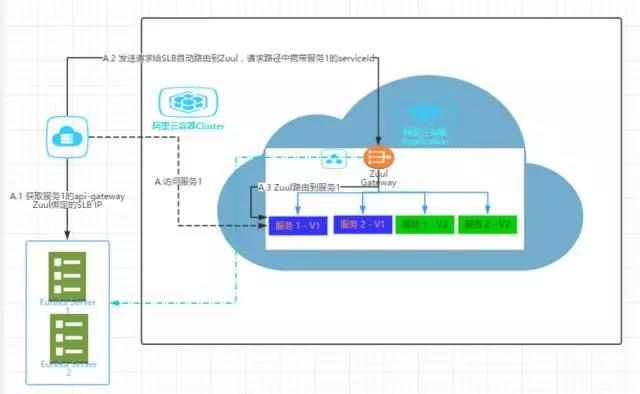
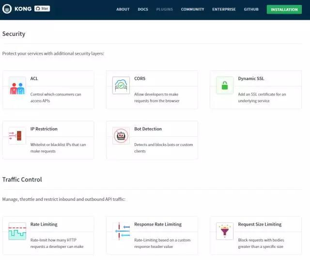

# 买单侠微服务的API网关演化之路

<!-- TOC -->

- [买单侠微服务的API网关演化之路](#买单侠微服务的api网关演化之路)
    - [原始时代-没有API网关的数百微服务](#原始时代-没有api网关的数百微服务)
    - [青铜时代-面向服务的网关Spring Cloud Zuul](#青铜时代-面向服务的网关spring-cloud-zuul)
    - [白银时代-支持灰度发布的服务分组入口Zuul](#白银时代-支持灰度发布的服务分组入口zuul)
    - [黄金时代-面向终端用户的出入口网关Nginx](#黄金时代-面向终端用户的出入口网关nginx)
    - [白金时代-接入层网关探索升级从Nginx到Kong](#白金时代-接入层网关探索升级从nginx到kong)
    - [总结](#总结)

<!-- /TOC -->

伴随着买单侠业务的快速发展，能够支持独立开发、独立部署、独立扩展的微服务在秦苍得到了广泛应用和蓬勃发展，短短3年左右时间，已经发展到了300+个微服务，并且还在快速增长中。

研发逐渐意识到伴随着微服务规模化的增长，必需要重视微服务的基础设施建设（API网关、服务注册中心、调用链跟踪等）才能保持开发效率和产品的质量。

API网关作为访问微服务的大门, 是访问后台服务的入口，作为最常用的基础服务之一，其重要性不言而喻。在买单侠微服务的发展道路上，经过了以下摸索发展阶段，希望能给规模化应用微服务的攻城狮们更多参考和启发。

## 原始时代-没有API网关的数百微服务

最初在没有API网关的日子，我们部署在阿里云上的服务全部使用阿里云的负载均衡SLB直接进行通信。不同的服务不同的环境配置不同的SLB地址，运维维护的配置文件存在着大量的SLB地址，稍不留意配置错误，就会影响发布上线。

客户端直接和各个服务直接交互，客户端和服务端有强耦合。服务端的波动会直接影响到客户端。

各个服务也是任意调用，公司服务调用的拓扑图，其实是一个混乱、混沌的蜘蛛网状图。对数百个这样微服务而言，没有隔离、没有把控，不仅容易引起问题，而且各个服务的通用需求认证、监控、转换等功能需要多次实现，无法重用。

## 青铜时代-面向服务的网关Spring Cloud Zuul

痛则思变，买单侠的微服务需要一个入口，就是API网关，帮助解耦客户端和具体后端微服务，它在微服务架构中很像面向对象设计模式中的Facade模式封装内部系统的架构，并且提供API给各个客户端作为服务入口。

由于买单侠微服务技术路线采用Spring Cloud,基于Netflix开源的基础组件搭建基础设施，例如服务注册中心Eureka,在API网关选项中，考虑和Eureka、Ribbon等的兼容，Zuul成了我们的不二选择。

作为API网关，Zuul能根据简单配置就能完成PATH和URL的路由映射转发。

Zuul提供了一个技术框架从请求抵达（pre），请求路由(route)到请求结束(post)以及请求出错(error)各个阶段Zuul都有专门类型的过滤器filter及示例，参见下图。开发可以在请求路由转发过程中的各个阶段实现自己的过滤器完成逻辑控制。

Zuul可以定时扫描指定目录下用户自己实现的groovy过滤器，通过groovy类加载器动态加载，从而在不用重启API网关下达到动态添加、更新过滤器。

由于买单侠的微服务使用了基于Spring Cloud Netflix的Eureka作为服务注册发现，Zuul也能作为Eureka Client从Eureka Server自动发现注册在上面的服务。

这样服务名可以作为发往网关请求的RootPath，比如业务线定义了一个API： /user 给手机端，以前得在Zuul添加mapping, /user --> /serviceName/user, 添加时需要改APIGateway的配置，改完需要重启。

现在，只要暴露给手机端是/demo-service/user, demo-service是服务名，经过Zuul时不用任何配置，它会根据eureka的服务名自动routing到demo-service, 然后调用user,所以serviceName 可以作为RootPath。无需额外配置，非常方便。

在产品线入口，买单侠开始引入Zuul作为API网关作为API门户管理转发请求到后端服务，并支持了请求校验和跨域功能。走出了原始时代的混沌。

## 白银时代-支持灰度发布的服务分组入口Zuul

Zuul开始帮助我们解耦了客户端和具体后端微服务，但对于上百微服务的规模化管理挑战一直存在，我们希望能达到微服务的分组和系统化管理。

比如一条产品线，可能会有直销商城、账务、审核、基础应用服务（字典服务）等业务系统（分组的服务）。而每个分组，会期望在请求抵达自己业务系统中做一些通用操作。

在这种背景下，我们期望Zuul成为服务分组后各个业务系统自己的入口服务。为此，我们改造了我们服务发现的调用方式。

| 类型  | 调用方式 |
|---|---|
| 服务分组内服务发现  | 直接调用  |
| 跨服务分组的服务发现  | 调用发给Zuul，再由Zuul转发到具体服务  |

服务分组内的服务每个服务注册到Eureka的metadata中专门有一项说明自己服务分组内的入口API网关Zuul的服务ID。然后服务调用时，先发现对应服务的Zuul是否和自己本身分组的Zuul服务ID一样，是就直接调用，否则请求自动发往对应服务Zuul，然后路由转发到对应服务。

Zuul可以自治化管理自己业务系统。比如我们要对一个业务系统中的部分服务做灰度发布。那么只需要更改直销商城业务系统API网关。

所以我们在Zuul里实现了灰度发布的策略管理，可以选择权重策略，白名单策略，用户区域策略等对用户进行自定义路由分流。

比如白名单策略，Zuul可以根据请求里的header信息，例如用户token来判断是否白名单中用户路由到指定服务，这样发布系统时，可以在旧服务在线情况下，发布新版本服务。让我们的QA作为白名单策略中用户路由到新版本服务系统中进行测试。测试通过后再切换流量到新版本服务，关闭老服务。

另外，买单侠微服务部署开始应用docker技术解决快速部署并达到跨环境标准一致。上百微服务不可能一次性迁移到容器环境，我们采取了分业务系统，按照服务分组逐步迁移的方式。这里的一个挑战是服务容器化后，基于overlay网络，有了独立于阿里云ECS机器的容器IP，现在注册到Eureka的就是容器IP。

在同一个集群内，即容器化的服务间基于容器IP是可以相互访问，但是集群外，即非容器化的服务根据容器IP是没法访问容器化的服务，网络是不同的。

阿里云容器平台推荐的迁移方案是给每个容器化服务绑定SLB（server load balance）一个静态IP地址来实现容器集群外服务访问容器服务。但是对于上百规模的微服务，每个服务配置SLB是巨大的工程，特别我们还有QA,Staging,Production三套环境，工作量翻了三倍。

API网关Zuul在这里继续扮演了极其重要的角色，简化解决了我们的这个迁移问题。我们仅仅把API网关Zuul作为每个服务分组的代理入口绑定了SLB，并且把这个静态IP作为Zuul的hostname注册到Eureka。服务分组外的服务对容器内服务1的访问包括下面几步：

1. 先获取到该服务1注册到Eureka的metadata,得到服务分组入口Zuul service ID。从Eureka中查到Zuul注册的hostname即SLB静态IP地址。
2. 按照SLB发送请求给Zuul,请求路径中携带服务1的serviced.
3. Zuul根据serviceId自动路由到服务1。

由此可见，Zuul作为每个服务分组的入口在买单侠微服务体系中作用巨大，解决了灰度发布、容器迁移等一系列关键问题，并将继续扮演举足轻重的角色。

## 黄金时代-面向终端用户的出入口网关Nginx

当众多服务分组有了自己的入口Zuul,在产品线面向用户的入口处网关又发现了一种尴尬情况。

原来有一个直接面向用户的Zuul将用户请求转发给后台服务,现在还有一个管理服务分组的入口网关，将服务分组外的后台请求转发给组内服务。

出现了两个入口！
 
同时，Zuul由于启用了Spring Boot Actuator,暴露了Log, Trace, Dump等敏感Endpoint,在安全方面引起了我们的担心顾虑。并且基于服务注册发现，理论上你知道serviceId可以把任意请求转发给对应服务。

面向终端用户，Zuul是最合适的入口选择吗？

并且在我们性能压力测试下，Zuul虽然适合编程实现业务逻辑，本身的性能并不占优，特别更改配置重启服务通常要2分钟左右非常慢。通常要部署多个Zuul容器保证高可用，还是有一定资源消耗。

对于终端用户，隐藏内部服务细节，并提供高性能的转发服务，Nginx其实是非常不错的选择。并在我们产品线开始推广使用。并且在一条产品线上可被多个业务系统（服务分组）共享使用，比如直销商城和直销客户，从而提高资源利用率。

**解决了入口问题，出口其实也是非常需要引起重视的。**

我们的微服务会有一些对外渠道，比如资金源需要访问不同的资金渠道，支付需要访问不同的支付渠道，不同渠道往往有不同的安全性要求，例如仅仅允许运行IP白名单的服务访问，需要特定证书。之前访问这些渠道都是由具体服务自己直接负责。

当业务规模，服务规模增大，对外出口的访问管理也容易引起混乱，对统一出口的需求变得强烈。

容器部署让统一出口成为必要需求，因为容器会在集群内机器上随机部署，具有随机IP，而给容器集群内所有机器配置白名单，装证书并不现实。

我们需要统一的API出口网关，在这里我们可以统一管理证书，提供固定IP。实际上就是一个代理帮助我们转发请求到外部渠道服务。

Nginx再次以优异表现胜任了我们的需求，担当我们的出口API网关，我们亲切地称呼它outlets。

每台Nginx代理固定在一台ECS上，提供ECS固定IP给外部数据提供商。Nginx启动速度快，并能动态加载配置，平滑升级。容器可以访问出口API网关来代理访问外部依赖服务。

## 白金时代-接入层网关探索升级从Nginx到Kong

在我们使用Nginx作为出入口网关过程中，我们也关注到基于Nginx的Kong。作为接入层网关，Kong继承Nginx的优异性能表现并且体现了更多的扩展性和网关管理功能。

基于OpenResty,所有对Kong的配置操作都通过REST API完成并且即时生效。

由于Kong基于Nginx，很多基本配置都可以映射到Nginx。

Kong一个非常吸引人的特色是它的丰富插件，有认证，安全，限流，监控，转换，日志等多种类型插件，能轻松配置完成访问控制，黑白名单设置，限流，跨域等等功能。

当然，由于Kong的灵活性，对于Kong的权限管理和使用流程上还有待规范。

不久我们可预期各条产品线不仅具有对外的接入层网关Kong,在这里可以基于Kong的插件实现业务无关的出入口基本管理，而且在它后面是由独立Zuul作为入口的各个业务系统，开发可以利用Zuul实现自己业务相关的入口控制管理。

## 总结

买单侠微服务的API网关演化之路着重分享了买单侠微服务体系中，API网关建设从无到有，从少到多，从单一到多元化的演进过程，下表总结了目前我们主要采用的网关技术方案。

在保障基本路由转发外，API网关更在买单侠的微服务治理中扮演重要角色，随着规模化管理和业务需求，其在服务分组管控、灰度发布、熔断监控、容器化迁移、统一出入口管理等场景都有深入实践，并且还在不断演进发展中。

作者简介

林丹，现任上海秦苍（买单侠）信息科技有限公司基础架构部架构师，毕业于哈尔滨工业大学软件工程专业，加入秦苍之前，曾在Autodesk、Blackboard公司任职。专注于SpringCloud、Docker、云计算、SaaS Performance、持续交付等相关领域，积累了丰富的互联网架构设计经验。目前主要负责微服务基础设施、Docker及CI/CD、前端等相关工作。