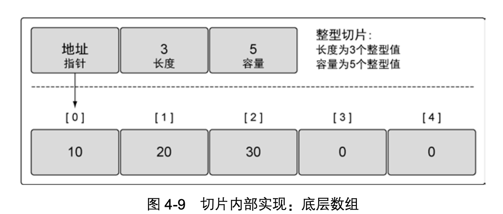
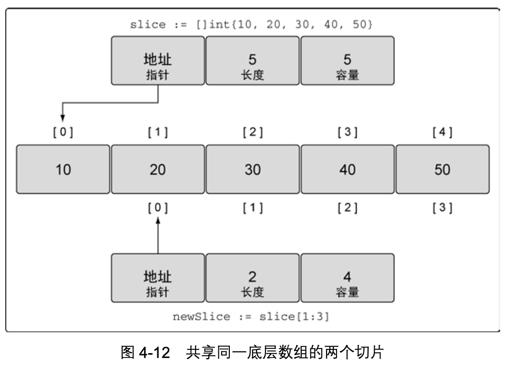
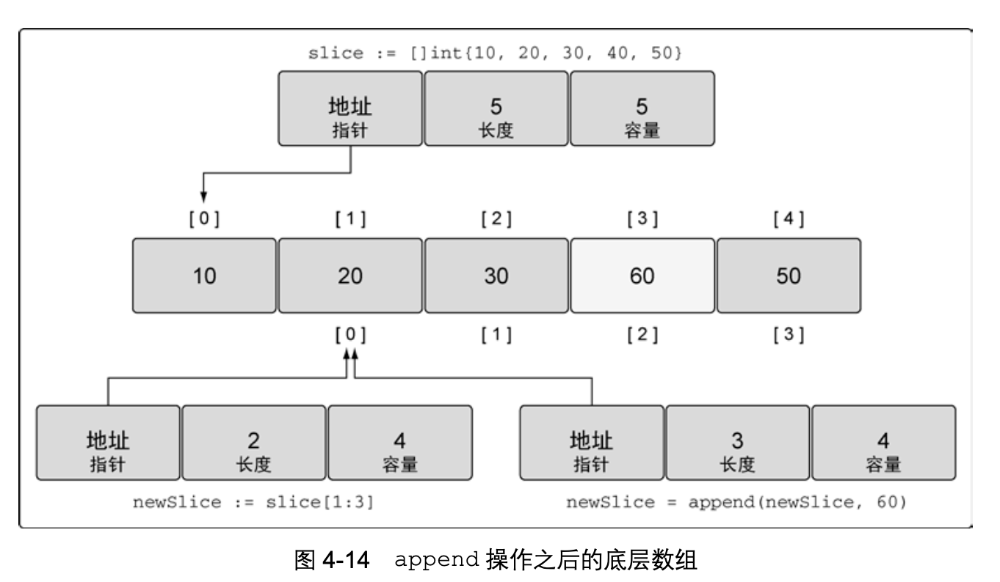
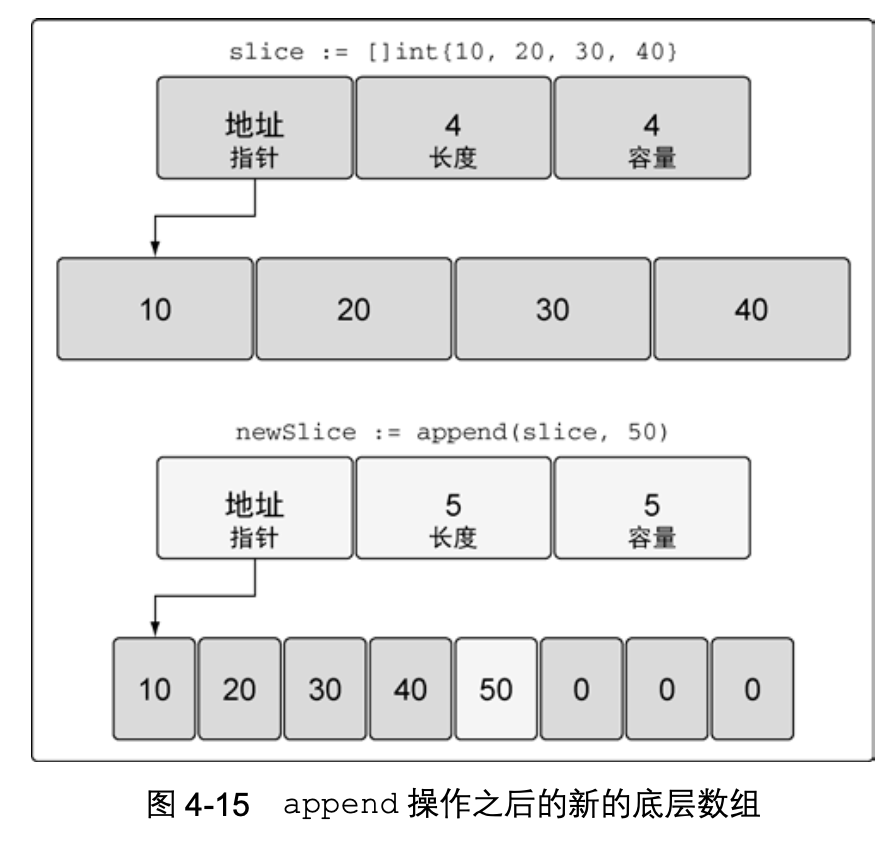
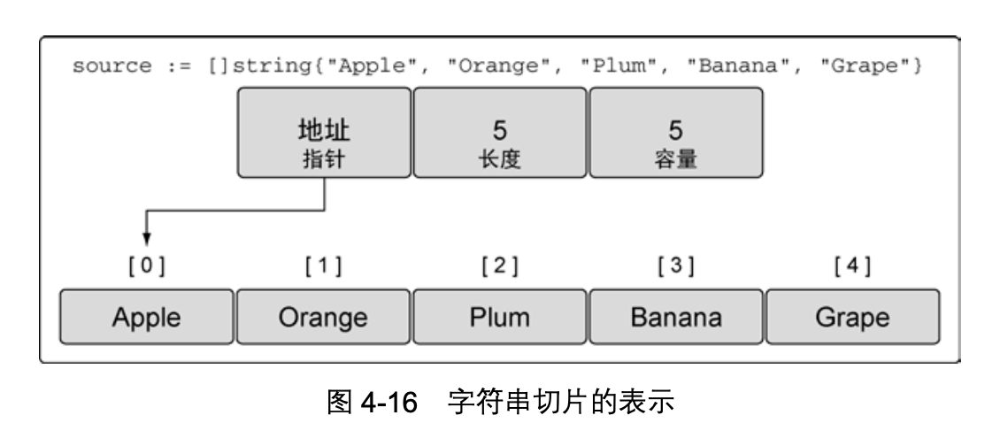
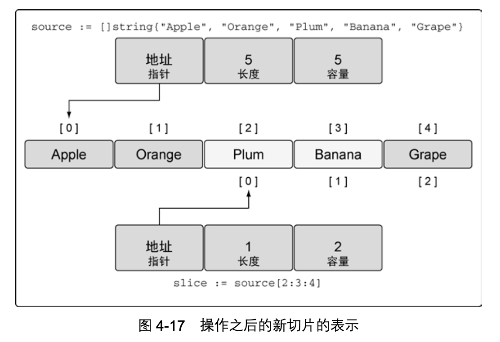

# 切片

- [切片](#切片)
  - [内部实现](#内部实现)
  - [创建和初始化](#创建和初始化)
  - [使用切片](#使用切片)
    - [赋值和切片](#赋值和切片)
    - [切片增长](#切片增长)
    - [创建切片时的 3 个索引](#创建切片时的-3-个索引)

切片是一种数据结构，这种数据结构便于使用和管理数据集合。切片是围绕动态数组的概念 构建的，可以按需自动增长和缩小。切片的动态增长是通过内置函数 append 来实现的。这个函 数可以快速且高效地增长切片。还可以通过对切片再次切片来缩小一个切片的大小。因为切片的 底层内存也是在连续块中分配的，所以切片还能获得索引、迭代以及为垃圾回收优化的好处。

## 内部实现

切片是一个很小的对象，对底层数组进行了抽象，并提供相关的操作方法。切片有 3 个字段 的数据结构，这些数据结构包含 Go 语言需要操作底层数组的元数据(见图 4-9)。
这 3 个字段分别是指向底层数组的指针、切片访问的元素的个数(即长度)和切片允许增长 到的元素个数(即容量)。后面会进一步讲解长度和容量的区别。



## 创建和初始化


当使用 make 时，需要传入一个参数，指定切片的长度，如果只指定长度，那么切片的容量和长度相等。

``` go
// 创建一个字符串切片
// 其长度和容量都是 5 个元素 
slice := make([]string, 5)
```


分别指定长度和容量时，创建的切片，底层数组的长度是指定的容量，但是初始化后并不能 访问所有的数组元素。

``` go
// 创建一个整型切片
// 其长度为 3 个元素，容量为 5 个元素 
slice := make([]int, 3, 5)
```

另一种常用的创建切片的方法是使用切片字面量，如代码清单 4-19 所示。这种方法和创建 数组类似，只是不需要指定[]运算符里的值。初始的长度和容量会基于初始化时提供的元素的 个数确定。


``` go
// 创建字符串切片
// 其长度和容量都是 5 个元素
slice := []string{"Red", "Blue", "Green", "Yellow", "Pink"}
// 创建一个整型切片
// 其长度和容量都是 3 个元素 
slice := []int{10, 20, 30}
```

## 使用切片

### 赋值和切片

对切片里某个索引指向的元素赋值和对数组里某个索引指向的元素赋值的方法完全一样。使
用[]操作符就可以改变某个元素的值，如代码清单 4-24 所示。

``` go
// 创建一个整型切片
// 其容量和长度都是 5 个元素
slice := []int{10, 20, 30, 40, 50}
// 改变索引为 1 的元素的值 
slice[1] = 25
```

切片之所以被称为切片，是因为创建一个新的切片就是把底层数组切出一部分，如代码清 单 4-25 所示。

``` go
// 创建一个整型切片
// 其长度和容量都是 5 个元素
slice := []int{10, 20, 30, 40, 50}
// 创建一个新切片
// 其长度为 2 个元素，容量为 4 个元素 
newSlice := slice[1:3]
```

执行完代码清单 4-25 中的切片动作后，我们有了两个切片，它们共享同一段底层数组，但 通过不同的切片会看到底层数组的不同部分(见图 4-12)。



第一个切片 slice 能够看到底层数组全部 5 个元素的容量，不过之后的 newSlice 就看不到。对于 newSlice，底层数组的容量只有 4 个元素。newSlice 无法访问到它所指向的底层数组的第一个元素之前的部分。所以，对 newSlice 来说，之前的那些元素就是不存在的。

**如何计算长度和容量?**

通过公式可以计算出任意切片的长度和容量。

对底层数组容量是 `k` 的切片 `slice[i:j]` 来说

- 长度: `j - i`
- 容量: `k - i`

对底层数组容量是 `5` 的切片 `slice[1:3]` 来说

- 长度: `3 - 1 = 2 `
- 容量: `5 - 1 = 4`


### 切片增长

Go 语言内置的 append 函数会处理增加长度时的所有操作细节。
要使用 append，需要一个被操作的切片和一个要追加的值。当 append 调用返回时，会返回一个包含修改结果的新切片。函数 append 总是会增加新切片的长度，而容量有可能会改变，也可能不会改变，这取决于被操作的切片的可用容量。

``` go
// 创建一个整型切片
// 其长度和容量都是 5 个元素
slice := []int{10, 20, 30, 40, 50}
// 创建一个新切片
// 其长度为 2 个元素，容量为 4 个元素 
newSlice := slice[1:3]
// 使用原有的容量来分配一个新元素
// 将新元素赋值为 60
newSlice = append(newSlice, 60)
```

当代码清单 4-30 中的 append 操作完成后，两个切片和底层数组的布局如图 4-14 所示。



因为 newSlice 在底层数组里还有额外的容量可用，append 操作将可用的元素合并到切片 的长度，并对其进行赋值。由于和原始的 slice 共享同一个底层数组，slice 中索引为 3 的元 素的值也被改动了。


如果切片的底层数组没有足够的可用容量，append 函数会创建一个新的底层数组，将被引 用的现有的值复制到新数组里，再追加新的值，如下所示：

``` go
// 创建一个整型切片
// 其长度和容量都是 4 个元素
slice := []int{10, 20, 30, 40}
// 向切片追加一个新元素
// 将新元素赋值为 50
newSlice := append(slice, 50)
```

当这个 append 操作完成后，newSlice 拥有一个全新的底层数组，这个数组的容量是原来的两倍



**函数 append 会智能地处理底层数组的容量增长。在切片的容量小于 1000 个元素时，总是会成倍地增加容量。一旦元素个数超过 1000，容量的增长因子会设为 1.25，也就是会每次增加 25% 的容量。随着语言的演化，这种增长算法可能会有所改变。**


### 创建切片时的 3 个索引

在创建切片时，还可以使用之前我们没有提及的第三个索引选项。第三个索引可以用来控制 新切片的容量。其目的并不是要增加容量，而是要限制容量。可以看到，允许限制新切片的容量 为底层数组提供了一定的保护，可以更好地控制追加操作。


让我们看看一个包含 5 个元素的字符串切片。这个切片包含了本地超市能找到的水果名字， 如下所示。

``` go
// 创建字符串切片
// 其长度和容量都是 5 个元素
source := []string{"Apple", "Orange", "Plum", "Banana", "Grape"}
```

如果查看这个包含水果的切片的值，就像图 4-16 所展示的样子。





让我们试着用第三个索引选项来完成切片操作，如代码清单 4-33 所示。

``` go
// 将第三个元素切片，并限制容量
// 其长度为 1 个元素，容量为 2 个元素 
slice := source[2:3:4]
```

这个切片操作执行后，新切片里从底层数组引用了 1 个元素，容量是 2 个元素。具体来说， 新切片引用了 Plum 元素，并将容量扩展到 Banana 元素，如图所示：



我们可以应用之前定义的公式来计算新切片的长度和容量

对于 `slice[i:j:k]` 或 `[2:3:4]`
 
- 长度: `j – i` 或 `3 - 2 = 1 `
- 容量: `k – i` 或 `4 - 2 = 2`


如果试图设置的容量比可用的容量还大，就会得到一个语言运行时错误

``` go
// 这个切片操作试图设置容量为 4 
// 这比可用的容量大
slice := source[2:3:6]


Runtime Error:
panic: runtime error: slice bounds out of range
```