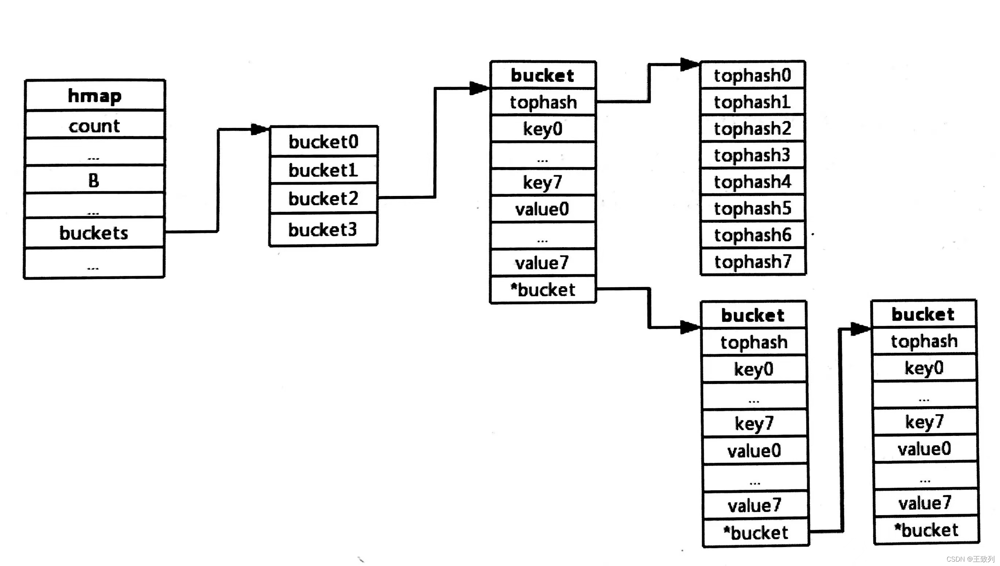

# map


- [map](#map)
  - [hmap](#hmap)
  - [bmap](#bmap)
  - [查找](#查找)
  - [map的扩容](#map的扩容)
  - [Hash冲突](#hash冲突)
  - [根据hash值计算桶数组下标index](#根据hash值计算桶数组下标index)
  - [负载因子](#负载因子)


## hmap

Go语言中map类型的底层实现就是哈希表，map类型的变量本质是是一个指针，指向hmap结构体。

- cout记录键值对的数目
- B记录桶的数目是2的多少次幂
- noverflow记录使用的溢出桶的数量
- buckets记录桶在哪
- oldbuckets用于扩容阶段记录旧桶在哪
- nevacuate记录渐进式扩容阶段下一个要要迁移的旧桶编号

## bmap

``` go
type bmap struct {
    topbits  [8]uint8
    keys     [8]keytype
    elems    [8]elemtype
    //pad      uintptr(新的 go 版本已经移除了该字段, 我未具体了解此处的 change detail, 之前设置该字段是为了在 nacl/amd64p32 上的内存对齐)
    overflow uintptr
}
```

bmap 表征了 go map 哈希桶的结构, 其中 

- topbits 是键哈希值的高 8 位, 
- keys 存放了哈希桶中所有键, 
- elems 存放了哈希桶中的所有值, 
- overflow 是一个 uintptr 类型指针, 存放了所指向的溢出桶的地址, 

go map 的每个哈希桶最多存放 8 个键值对, 当经由哈希函数映射到该地址的元素数超过 8 个时, 会将新的元素放到溢出桶中, 并使用 overflow 指针链向这个溢出桶, 这里有一个需要注意的点是在哈希桶中, 键值之间并不是相邻排列的, 这是为了保证内存对齐


## 查找


1. 根据key计算出哈希值
1. 根据哈希值低位确定所在bucket
1. 根据哈希值高8位确定在bucket中的存储位置
1. 当前bucket未找到则查找对应的overflow bucket。
1. 对应位置有数据则对比完整的哈希值，确定是否是要查找的数据
2. 如果当前处于map进行了扩容，处于数据搬移状态，则优先从oldbuckets查找。


当要根据 key 从 map 中查询对应的 elem 时, 在 go 有两种写法, 

例如我们定义 `hash := make(map[int]int)`  
则可以使用 `s := hash[key]`, 也可以使用 `s, ok := hash[key]`, 

- 第一种写法无论 key 是否存在于 map 中, s 都会获取一个返回值, 而当 key 不存在时会返回对应类型的零值, 
- 第二种写法中, ok 变量可以标识此次是否从 map 中真正的获取到了 key 所对应的 elem, 

在 go 语言底层, 这两种写法实际会调用两个不同函数, 它们都位于 `src/runtime/map.go` 中, 分别调用 mapaccess1 和 mapaccess2 函数, 这两个函数的内部逻辑几乎是一样的, 第二个相比于第一个仅仅多了一个是否查询到的标志位, 我们只来分析 mapaccess1 函数即可。

go map 中使用了 aes 和 memhash 两类哈希, 当运行架构支持 aes 哈希时会优先使用 aes 作为 HashFunc, 具体的判定逻辑在 src/runtime/alg.go 的 alginit() 函数中, 


**哈希桶的地址**

当要 map 中查询一个元素时, go 首先使用 key 和哈希表的 hash0, 即创建 map 时生成的随机数做哈希函数运算得到哈希值, hmap 中的 B 表征了当前哈希表中的哈希桶数量, 哈希桶数量等于 `2的B次幂方` , 这里 go 使用了我们在第一节提到的除留余数法来计算得到相应的哈希桶, 因为桶的数量是 2 的整数次幂, 因此这里的取余运算可以使用位运算来替代, 

将哈希值与桶长度减一做按位与即得到了对应的桶编号, 当前这里的桶编号是一个逻辑编号, hmap 结构中存储了哈希桶的内存地址, 在这个地址的基础上偏移桶编号*桶长度便得到了对应的哈希桶的地址, 


**哈希桶中找寻 key 对应的元素**

在哈希桶中找寻 key 对应的元素, 比较的时候基于哈希值的高 8 位与桶中的 topbits 依次比较, 若相等便可以根据 topbits 所在的相对位置计算出 key 所在的相对位置, 进一步比较 key 是否相等, 若 key 相等则此次查找过程结束, 返回对应位置上 elem, 若 key 不相等, 则继续往下比较 topbits, 

若当前桶中的所有 topbits 均与此次要找到的元素的 key 的哈希值的高 8 位不相等, 则继续沿着 overflow 向后探查溢出桶, 重复刚刚的过程, 直到找到对应的 elem, 或遍历完所有的溢出桶仍未找到目标元素, 此时返回该类型的零值


## map的扩容

- Go语言中map的默认负载因子是6.5，超过这个数就会触发翻倍扩容。

当以上的哈希表增长的时候，Go语言会将bucket数组的数量扩充一倍，产生一个新的bucket数组，并将旧数组的数据迁移至新数组。

**加载因子**

判断扩充的条件，就是哈希表中的加载因子(即loadFactor)。

加载因子是一个阈值，一般表示为：散列包含的元素数 除以 位置总数。是一种“产生冲突机会”和“空间使用”的平衡与折中：加载因子越小，说明空间空置率高，空间使用率小，但是加载因子越大，说明空间利用率上去了，但是“产生冲突机会”高了。

每种哈希表的都会有一个加载因子，数值超过加载因子就会为哈希表扩容。
Golang的map的加载因子的公式是：map长度 / 2^B (这是代表bmap数组的长度，B是取的低位的位数)阈值是6.5。其中B可以理解为已扩容的次数。

当Go的map长度增长到大于加载因子所需的map长度时，Go语言就会将产生一个新的bucket数组，然后把旧的bucket数组移到一个属性字段oldbucket中。

> 注意：并不是立刻把旧的数组中的元素转义到新的bucket当中，而是，只有当访问到具体的某个bucket的时候，会把bucket中的数据转移到新的bucket中。

如下图所示：当扩容的时候，Go的map结构体中，会保存旧的数据，和新生成的数组


## Hash冲突

当有两个或以上数量的键“Hash”到了同一个bucket时，我们称这些键发生了冲突，Go使用链地址法来解决键冲突，由于每个bucket可以存放8个键值对，所以同一个bucket存放超过8个键值对时就会再创建一个bucket，用类似链表的方式将bucket连接起来，产生冲突后hash的存储如下图所示：




按key的类型采用相应的hash算法得到key的hash值。将hash值的低位当作hmap结构体中buckets数组的index，找到key所在的bucket。将hash的高8位存储在了bucket的tophash中。注意，这里高8位不是用来当作key/value在bucket内部的offset的，而是作为一个主键，在查找时对tophash数组的每一项进行顺序匹配的。先比较hash值高位与bucket的tophash[i]是否相等，如果相等则再比较bucket的第i个的key与所给的key是否相等。如果相等，则返回其对应的value，反之，在overflow buckets中按照上述方法继续寻找。

## 根据hash值计算桶数组下标index


计算桶数组下标的方法不是取模，而是用hash值和2^B-1进行按位与操作，这里对此进行一个解释：首先bucket数组的长度为 2^B ，即2的次幂数，而 2^B-1 转换成二进制后一定是低位全1，高位全0的形式，因此在进行按位与操作后，一定能求得一个在 `[ 0, 2^B-1 ]` 区间上的任意一个数，也就是数组中的下标位置，相较之下，能获得比取模更加优秀的执行效率。


**然而为什么前面要求buckets数组长度必须是2的次幂数呢？**

这是因为若不是2的次幂数，则buckets数组长度n转成二进制不是一个低位全1，高位全0的形式，则将其作为掩码与任意key的hash值进行按位与后，虽然得出来的数仍然在[0,2^B-1]区间上，但反过来，这些区间上的数，必定有些数永远不会出现，这也就意味着map的buckets数组里某些位置上永远不可能存数据，这显然是不合理的（既浪费了空间，又影响了散列性，大大降低查询效率），这也是Go把buckets数组长度设计成为 `2^B` 的主要原因。


举例说明：

```
buckets数组长度为16（2^4）时
2^B-1：	        0000 1111
key.hashcode：	**** ****
&
index：			0000 ****
//即根据hash值的低 B 位确定index
//hash值低 B 位相同的键进入buckets数组相同的bucket
============================
buckets数组长度为 10 时
buckets.length-1：	0000 1001
key.hashcode：	    **** ****
&
index：			    0000 *00*
//中间两位必是0，即这些位是1的下标值必定不可能求得，
//这个例子中，按位与得出的index只可能是0,1,8,9四个值
```

> **哈希表大小始终为2的指数倍，则有(hash mod 2^B)等价于(hash & (2^B-1))。这样可以简化运算，避免了取模操作。**


## 负载因子

负载因子用于衡量一个hash表冲突的情况：

负载因子 = 键数量 / bucket数量

负载因子过小，说明空间利用率低
负载因子过大，说明冲突严重，存取效率低
负载因子过小，可能是预分配的空间太大，也可能是大部分元素被删除造成的。随着元素不断添加到map中，负载因子会逐渐升高。


> 参考如下：  
> https://www.cnblogs.com/flippedxyy/p/15558754.html
> https://blog.csdn.net/Star_of_science/article/details/121802354
> https://www.bilibili.com/read/cv5588300/