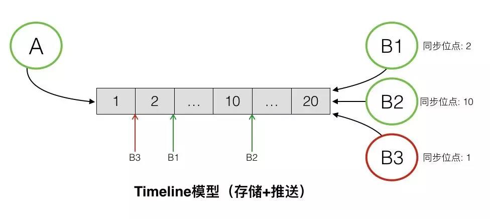
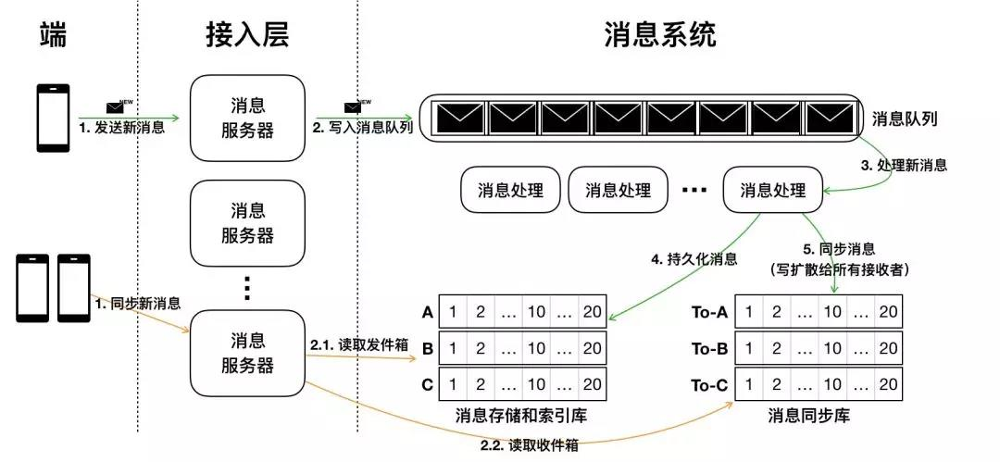

# 现代IM系统中的消息系统架构 - 架构篇

<!-- TOC -->

- [现代IM系统中的消息系统架构 - 架构篇](#现代im系统中的消息系统架构---架构篇)
    - [前言](#前言)
    - [基础模型](#基础模型)
    - [Timeline模型](#timeline模型)
    - [消息存储模型](#消息存储模型)
    - [消息同步模型](#消息同步模型)
    - [典型架构设计](#典型架构设计)
    - [总结](#总结)

<!-- /TOC -->

作者：木洛，阿里云存储高级技术专家

## 前言

M全称是『Instant Messaging』，中文名是即时通讯。在这个高度信息化的移动互联网时代，生活中IM类产品已经成为必备品，比较有名的如钉钉、微信、QQ等以IM为核心功能的产品。当然目前微信已经成长为一个生态型产品，但其核心功能还是IM。还有一些非以IM系统为核心的应用，最典型的如一些在线游戏、社交应用，IM也是其重要的功能模块。可以说，IM系统已经是任何一个带有社交属性的应用需要具备的基础功能，网络上对于这类系统的设计与实现的讨论也越来越多。

IM系统在互联网初期即存在，其基础技术架构在这十几年的发展中更新迭代多次，从早期的CS、P2P架构，到现在后台已经演变为一个复杂的分布式系统，涉及移动端、网络通信、协议、安全、存储和搜索等技术的方方面面。IM系统中最核心的部分是消息系统，消息系统中最核心的功能是消息的同步、存储和检索：

- **消息的同步**：将消息完整的、快速的从发送方传递到接收方，就是消息的同步。消息同步系统最重要的衡量指标就是消息传递的实时性、完整性以及能支撑的消息规模。从功能上来说，一般至少要支持在线和离线推送，高级的IM系统还支持『多端同步』。
- **消息的存储**：消息存储即消息的持久化保存，传统消息系统通常只能支持消息在接收端的本地存储，数据基本不具备可靠性。现代消息系统能支持消息在服务端的在线存储，功能上对应的就是『消息漫游』，消息漫游的好处是可以实现账号在任意端登陆查看所有历史消息。
- **消息的检索**：消息一般是文本，所以支持全文检索也是必备的能力之一。传统消息系统通常来说也是只能支持消息的本地检索，基于本地存储的消息数据来构建。而现在消息系统在能支持消息的在线存储后，也具备了消息的『在线检索』能力。

本篇文章内容主要涉及IM系统中的消息系统架构，会介绍一种基于阿里云表格存储Tablestore的Timeline模型构建的消息系统。基于Tablestore Timeline构建的现代消息系统，能够同时支持消息系统的众多高级特性，包括『多端同步』、『消息漫游』和『在线检索』。在性能和规模上，能够做到全量消息云端存储和索引，百万TPS写入以及毫秒级延迟的消息同步和检索能力。

之后我们会继续发表两篇文章，来更详细介绍Tablestore Timeline模型概念及使用：

- **模型篇**：详细介绍Tablestore Timeline模型的基本概念和基础数据结构，并结合IM系统进行基本的建模。
- **实现篇**：会基于Tablestore Timeline实现一个具备『多端同步』、『消息漫游』和『在线检索』这些高级功能的简易IM系统，并共享我们的源代码。

下图：传统架构 vs 现代架构

**传统架构下**，消息是先同步后存储。对于在线的用户，消息会直接实时同步到在线的接收方，消息同步成功后，并不会在服务端持久化。而对于离线的用户或者消息无法实时同步成功时，消息会持久化到离线库，当接收方重新连接后，会从离线库拉取所有未读消息。当离线库中的消息成功同步到接收方后，消息会从离线库中删除。传统的消息系统，服务端的主要工作是维护发送方和接收方的连接状态，并提供在线消息同步和离线消息缓存的能力，保证消息一定能够从发送方传递到接收方。服务端不会对消息进行持久化，所以也无法支持消息漫游。消息的持久化存储及索引同样只能在接收端本地实现，数据可靠性极低。

**现代架构下**，消息是先存储后同步。先存储后同步的好处是，如果接收方确认接收到了消息，那这条消息一定是已经在云端保存了。并且消息会有两个库来保存，一个是消息存储库，用于全量保存所有会话的消息，主要用于支持消息漫游。另一个是消息同步库，主要用于接收方的多端同步。消息从发送方发出后，经过服务端转发，服务端会先将消息保存到消息存储库，后保存到消息同步库。完成消息的持久化保存后，对于在线的接收方，会直接选择在线推送。但在线推送并不是一个必须路径，只是一个更优的消息传递路径。对于在线推送失败或者离线的接收方，会有另外一个统一的消息同步方式。接收方会主动的向服务端拉取所有未同步消息，但接收方何时来同步以及会在哪些端来同步消息对服务端来说是未知的，所以要求服务端必须保存所有需要同步到接收方的消息，这是消息同步库的主要作用。对于新的同步设备，会有消息漫游的需求，这是消息存储库的主要作用，在消息存储库中，可以拉取任意会话的全量历史消息。消息检索的实现依赖于对消息存储库内消息的索引，通常是一个近实时（NRT，near real time）的索引构建过程，这个索引同样是在线的。

以上就是传统架构和现代架构的一个简单的对比，现代架构上整个消息的同步、存储和索引流程，并没有变复杂太多。现代架构的实现本质上是把传统架构内本地存储和索引都搬到云上，最大挑战是需要集中管理全量消息的存储和索引，带来的好处是能实现多端同步、消息漫游以及在线检索。可以看到现代架构中最核心的就是两个消息库『消息同步库』和『消息存储库』，以及对『消息存储库』的『消息索引』的实现，接下来我们逐步拆解这几个核心的设计和实现。

## 基础模型

在深入讲解消息系统的设计和实现之前，需要对消息系统内的几个基本概念和基础模型有一个理解。网上分析的很多的不同类型的消息系统实现，实现差异上主要在消息同步和存储的方案上，在消息的数据模型上其实有很大的共性。围绕数据同步模型的讨论主要在『读扩散』、『写扩散』和『混合模式』这三种方案，目前还没有更多的选择。而对于数据模型的抽象，还没有一个标准的定义。

本章节会介绍下表格存储Tablestore提出的Timeline模型，这是一个对消息系统内消息模型的一个抽象，能简化和更好的让开发者理解消息系统内的消息同步和存储模型，基于此模型我们会再深入探讨消息的同步和存储的选择和实现。

## Timeline模型

Timeline是一个对消息抽象的逻辑模型，该模型会帮助我们简化对消息同步和存储模型的理解，而消息同步库和存储库的设计和实现也是围绕Timeline的特性和需求来展开。

如图是Timeline模型的一个抽象表述，Timeline可以简单理解为是一个消息队列，但这个消息队列有如下特性：

- **每条消息对应一个顺序ID**：每个消息拥有一个唯一的顺序ID（SequenceId），队列消息按SequenceId排序。
- **新消息写入能自动分配递增的顺序ID**，保证永远插入队尾：Timeline中是根据同步位点也就是顺序ID来同步消息，所以需要保证新写入的消息数据的顺序ID绝对不能比已同步的消息的顺序ID还小，否则会导致数据漏同步，所以需要支持对新写入的数据自动分配比当前已存储的所有消息的顺序ID更大的顺序ID。
- **新消息写入也能自定义顺序ID**，满足自定义排序需求：上面提到的自动分配顺序ID，主要是为了满足消息同步的需求，消息同步要求消息是根据『已同步』或是『已写入』的顺序来排序。而消息的存储，通常要求消息能根据会话顺序来排序，会话顺序通常由端的会话来决定，而不是服务端的同步顺序来定，这是两种顺序要求。
- **支持根据顺序ID的随机定位**：可根据SequenceId随机定位到Timeline中的某个位置，从这个位置开始正序或逆序的读取消息，也可支持读取指定顺序ID的某条消息。
- **支持对消息的自定义索引**：消息体内数据根据业务不同会包含不同的字段，Timeline需要支持对不同字段的自定义索引，来支持对消息内容的全文索引，或者是任意字段的灵活条件组合查询。

**消息同步**可以基于Timeline很简单的实现，图中的例子中，消息发送方是A，消息接收方是B，同时B存在多个接收端，分别是B1、B2和B3。A向B发送消息，消息需要同步到B的多个端，待同步的消息通过一个Timeline来进行交换。A向B发送的所有消息，都会保存在这个Timeline中，B的每个接收端都是独立的从这个Timeline中拉取消息。每个接收端同步完毕后，都会在本地记录下最新同步到的消息的SequenceId，即最新的一个位点，作为下次消息同步的起始位点。服务端不会保存各个端的同步状态，各个端均可以在任意时间从任意点开始拉取消息。

**消息存储**也是基于Timeline实现，和消息同步唯一的区别是，消息存储要求服务端能够对Timeline内的所有数据进行持久化，并且消息采用会话顺序来保存，需要自定义顺序ID。

**消息检索**基于Timeline提供的消息索引来实现，能支持比较灵活的多字段索引，根据业务的不同可有自由度较高的定制。

## 消息存储模型

如图是基于Timeline的消息存储模型，消息存储要求每个会话都对应一个独立的Timeline。如图例子所示，A与B/C/D/E/F均发生了会话，每个会话对应一个独立的Timeline，每个Timeline内存有这个会话中的所有消息，消息根据会话顺序排序，服务端会对每个Timeline进行持久化存储，也就拥有了消息漫游的能力。

## 消息同步模型

消息同步模型会比消息存储模型稍复杂一些，消息的同步一般有读扩散（也叫拉模式）和写扩散（也叫推模式）两种不同的方式，分别对应不同的Timeline物理模型。

如图是读扩散和写扩散两种不同同步模式下对应的不同的Timeline模型，按图中的示例，A作为消息接收者，其与B/C/D/E/F发生了会话，每个会话中的新的消息都需要同步到A的某个端，看下读扩散和写扩散两种模式下消息如何做同步。

- **读扩散**：消息存储模型中，每个会话的Timeline中保存了这个会话的全量消息。读扩散的消息同步模式下，每个会话中产生的新的消息，只需要写一次到其用于存储的Timeline中，接收端从这个Timeline中拉取新的消息。优点是消息只需要写一次，相比写扩散的模式，能够大大降低消息写入次数，特别是在群消息这种场景下。但其缺点也比较明显，接收端去同步消息的逻辑会相对复杂和低效。接收端需要对每个会话都拉取一次才能获取全部消息，读被大大的放大，并且会产生很多无效的读，因为并不是每个会话都会有新消息产生。
- **写扩散**：写扩散的消息同步模式，需要有一个额外的Timeline来专门用于消息同步，通常是每个接收端都会拥有一个独立的同步Timeline（或者叫收件箱），用于存放需要向这个接收端同步的所有消息。每个会话中的消息，会产生多次写，除了写入用于消息存储的会话Timeline，还需要写入需要同步到的接收端的同步Timeline。在个人与个人的会话中，消息会被额外写两次，除了写入这个会话的存储Timeline，还需要写入参与这个会话的两个接收者的同步Timeline。而在群这个场景下，写入会被更加的放大，如果这个群拥有N个参与者，那每条消息都需要额外的写N次。写扩散同步模式的优点是，在接收端消息同步逻辑会非常简单，只需要从其同步Timeline中读取一次即可，大大降低了消息同步所需的读的压力。其缺点就是消息写入会被放大，特别是针对群这种场景。

Timeline模型不会对选择读扩散还是写扩散做约束，而是能同时支持两种模式，因为本质上两种模式的逻辑数据模型并无差别，只是消息数据是用一个Timeline来支持多端读还是复制到多个Timeline来支持多端读的问题。

针对IM这种应用场景，消息系统通常会选择写扩散这种消息同步模式。IM场景下，一条消息只会产生一次，但是会被读取多次，是典型的读多写少的场景，消息的读写比例大概是10:1。若使用读扩散同步模式，整个系统的读写比例会被放大到100:1。一个优化的好的系统，必须从设计上去平衡这种读写压力，避免读或写任意一维触碰到天花板。所以IM系统这类场景下，通常会应用写扩散这种同步模式，来平衡读和写，将100:1的读写比例平衡到30:30。当然写扩散这种同步模式，还需要处理一些极端场景，例如万人大群。针对这种极端写扩散的场景，会退化到使用读扩散。一个简单的IM系统，通常会在产品层面限制这种大群的存在，而对于一个高级的IM系统，会采用读写扩散混合的同步模式，来满足这类产品的需求。采用混合模式，会根据数据的不同类型和不同的读写负载，来决定用写扩散还是读扩散。

## 典型架构设计

如图是一个典型的消息系统架构，架构中包含几个重要组件：

- **端**：作为消息的发送和接收端，通过连接消息服务器来发送和接收消息。
- **消息服务器**：一组无状态的服务器，可水平扩展，处理消息的发送和接收请求，连接后端消息系统。
- **消息队列**：新写入消息的缓冲队列，消息系统的前置消息存储，用于削峰填谷以及异步消费。
- **消息处理**：一组无状态的消费处理服务器，用于异步消费消息队列中的消息数据，处理消息的持久化和写扩散同步。
- **消息存储和索引库**：持久化存储消息，每个会话对应一个Timeline进行消息存储，存储的消息建立索引来实现消息检索。
- **消息同步库**：写扩散形式同步消息，每个用户的收件箱对应一个Timeline，同步库内消息不需要永久保存，通常对消息设定一个生命周期。

新消息会由端发出，通常消息体中会携带消息ID（用于去重）、逻辑时间戳（用于排序）、消息类型（控制消息、图片消息或者文本消息等）、消息体等内容。消息会先写入消息队列，作为底层存储的一个临时缓冲区。消息队列中的消息会由消息处理服务器消费，可以允许乱序消费。消息处理服务器对消息先存储后同步，先写入发件箱Timeline（存储库），后写扩散至各个接收端的收件箱（同步库）。消息数据写入存储库后，会被近实时的构建索引，索引包括文本消息的全文索引以及多字段索引（发送方、消息类型等）。

对于在线的设备，可以由消息服务器主动推送至在线设备端。对于离线设备，登录后会主动向服务端同步消息。每个设备会在本地保留有最新一条消息的顺序ID，向服务端同步该顺序ID后的所有消息。

## 总结

本篇文章主要介绍了现代IM系统中消息系统所需要具备的能力，对比了传统架构和现代架构。为方便接下来的深入探讨，介绍了表格存储Tablestore推出的Timeline模型，以及在IM系统中消息存储和消息同步模型的基本概念和策略，最后介绍了一个典型的架构设计。