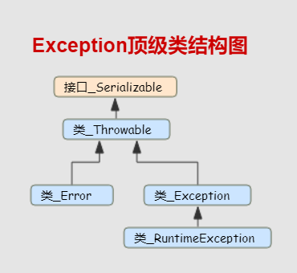
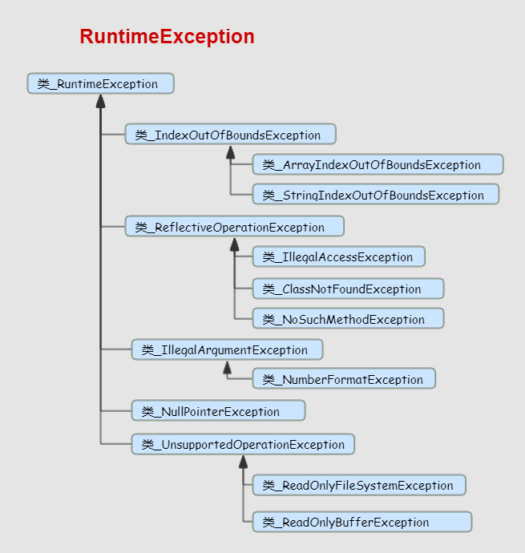
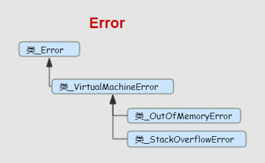

# Exception 异常

## 运行时异常

java.lang.ArrayIndexOutOfBoundsException 

这个异常的解释是"数组下标越界"，现在程序中大多都有对数组的操作，因此在调用数组的时候一定要认真检查，看自己调用的下标是不是超出了数组的范围，一般来说，显示（即直接用常数当下标）调用不太容易出这样的错，但隐式（即用变量表示下标）调用就经常出错了，还有一种情况，是程序中定义的数组的长度是通过某些特定方法决定的，不是事先声明的，这个时候，最好先查看一下数组的length，以免出现这个异常。

java.lang.IllegalAccessException 无访问权限异常

java.lang.NoSuchMethodError   

方法不存在错误。当应用试图调用某类的某个方法，而该类的定义中没有该方法的定义时抛出该错误。

java.lang.ClassNotFoundException 

异常的解释是"指定的类不存在"，这里主要考虑一下类的名称和路径是否正确即可

java.lang.NullPointerException 

这个异常的解释是 "程序遇上了空指针 "

java.lang.IllegalArgumentException 方法参数错误 

java.lang.NumberFormatException     

数字格式异常。当试图将一个String转换为指定的数字类型，而该字符串确不满足数字类型要求的格式时，抛出该异常。 

## Error

Error类层次结构描述了Java运行时系统的内部错误和资源耗尽错误。应用程序不应该抛出这种类型的错误。如果出现了这样的内部错误，除了通告给用户，并尽力使程序安全地终止之外，再也无能为力了。这种情况很少出现。

- VirtualMachineError 虚拟机错误
