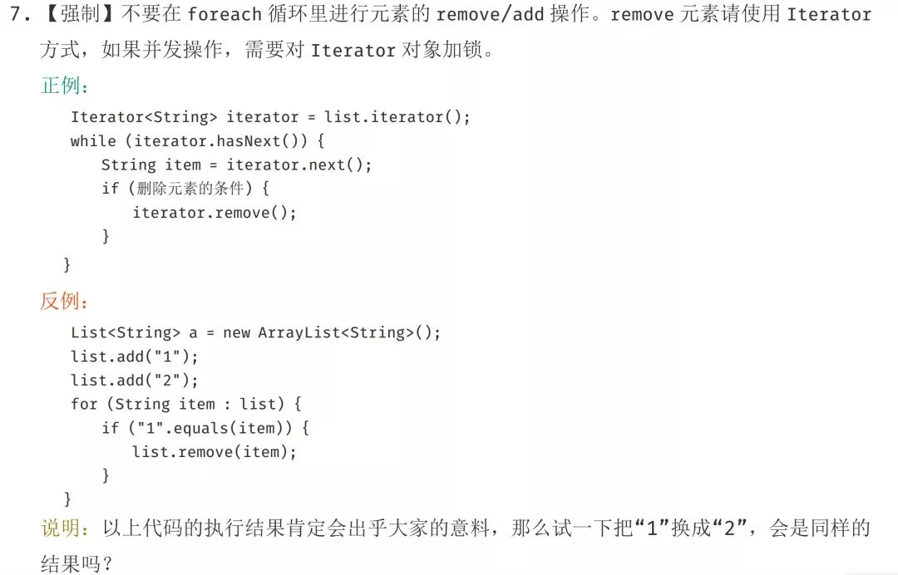

# 为什么阿里巴巴禁止在 foreach 循环里进行元素的 remove/add 操作

<!-- TOC -->

- [为什么阿里巴巴禁止在 foreach 循环里进行元素的 remove/add 操作](#为什么阿里巴巴禁止在-foreach-循环里进行元素的-removeadd-操作)
    - [foreach 循环](#foreach-循环)
    - [问题重现](#问题重现)
    - [remove/add 做了什么](#removeadd-做了什么)
    - [正确姿势](#正确姿势)
        - [1. 直接使用普通for循环进行操作](#1-直接使用普通for循环进行操作)
        - [2. 直接使用Iterator进行操作](#2-直接使用iterator进行操作)
        - [3. 使用Java 8中提供的filter过滤](#3-使用java-8中提供的filter过滤)
        - [4. 直接使用fail-safe的集合类](#4-直接使用fail-safe的集合类)
        - [5. 使用增强for循环其实也可以](#5-使用增强for循环其实也可以)
    - [总结](#总结)

<!-- /TOC -->

> https://blog.csdn.net/bjweimengshu/article/details/88685149

在阿里巴巴Java开发手册中，有这样一条规定，但是手册中并没有给出具体原因，本文就来深入分析一下该规定背后的思考。



## foreach 循环

foreach循环（Foreach loop）是计算机编程语言中的一种控制流程语句，通常用来循环遍历数组或集合中的元素。

Java语言从JDK 1.5.0开始引入foreach循环。在遍历数组、集合方面，foreach为开发人员提供了极大的方便。通常也被称之为 **增强for循环**。

普通for循环 和 foreach循环使用如下：

``` java

public static void main(String[] args) {
    List<String> list = new ArrayList(){{
        add("a");
        add("b");
        add("c");
        add("d");
        add("e");
    }};

    System.out.println("普通for循环输出：");

    for (int i = 0; i < list.size(); i++) {
        System.out.println(list.get(i));
    }

    System.out.println("foreach 循环输出：");

    for (String s : list) {
        System.out.println(s);
    }
}
```

输出如下：

```
普通for循环输出：
a
b
c
d
e
foreach 循环输出：
a
b
c
d
e
```

可以看到，使用foreach语法遍历集合或者数组的时候，可以起到和普通for循环同样的效果，并且代码更加简洁。所以，foreach循环也通常也被称为增强for循环。但是，作为一个合格的程序员，我们不仅要知道什么是增强for循环，还需要知道增强for循环的原理是什么？其实，增强for循环也是Java给我们提供的一个语法糖，如果将以上代码编译后的class文件进行反编译（使用jad工具）的话，可以得到以下代码：


``` java
Iterator iterator = userNames.iterator();
do
{
    if(!iterator.hasNext())
        break;
    String userName = (String)iterator.next();
    if(userName.equals("Hollis"))
        userNames.remove(userName);
} while(true);
System.out.println(userNames);
```

可以发现， **原本的增强for循环，其实是依赖了while循环和Iterator实现的。** （请记住这种实现方式，后面会用到！）

## 问题重现

规范中指出不让我们在foreach循环中对集合元素做add/remove操作，那么，我们尝试着做一下看看会发生什么问题。


使用普通for循环对List进行遍历，删除List中元素，然后输出List，代码如下：

``` java
for (int i = 0; i < list.size(); i++) {
    if (list.get(i) == "a"||list.get(i) == "c") {
        list.remove(i);
    }
}
System.out.printf(list.toString());
```
输出结果如下：
```
[b, d, e]
```


使用增强for循环遍历元素，并尝试删除其中元素。运行代码，会抛出以下异常：

``` java
for (String s : list) {
    if (s.equals("a")) {
        list.remove(s);
    }
}
System.out.println(list);
```

```
Exception in thread "main" java.util.ConcurrentModificationException
	at java.util.ArrayList$Itr.checkForComodification(ArrayList.java:901)
	at java.util.ArrayList$Itr.next(ArrayList.java:851)
	at org.ak47.shardingjdbc.ListFor.main(ListFor.java:41)
```

同样的，可以尝试下在增强for循环中使用add方法添加元素，结果也会同样抛出该异常。

之所以会出现这个异常，是因为触发了一个Java集合的错误检测机制——fail-fast 。


fail-fast，即快速失败，它是Java集合的一种错误检测机制。当多个线程对集合（非fail-safe的集合类）进行结构上的改变的操作时，有可能会产生fail-fast机制，这个时候就会抛出ConcurrentModificationException（当方法检测到对象的并发修改，但不允许这种修改时就抛出该异常）。

同时需要注意的是，即使不是多线程环境，如果单线程违反了规则，同样也有可能会抛出改异常。


异常定位到如下方法：

``` java
final void checkForComodification() {
    if (modCount != expectedModCount)
        throw new ConcurrentModificationException();
}
```
代码比较简单，`modCount != expectedModCount`的时候，就会抛出 `ConcurrentModificationException` 。

## remove/add 做了什么

首先，我们要搞清楚的是，到底modCount和expectedModCount这两个变量都是个什么东西。

通过翻源码，我们可以发现：

- `modCount` 是ArrayList中的一个成员变量。它表示该集合实际被修改的次数。
- `expectedModCount`  是 ArrayList中的一个内部类——Itr中的成员变量。expectedModCount表示这个迭代器期望该集合被修改的次数。其值是在 `ArrayList.iterator` 方法被调用的时候初始化的。只有通过迭代器对集合进行操作，该值才会改变。
- `Itr` 是一个Iterator的实现，使用 `ArrayList.iterator` 方法可以获取到的迭代器就是Itr类的实例。

他们之间的关系如下：

``` java
class ArrayList{
    private int modCount;
    public void add();
    public void remove();
    private class Itr implements Iterator<E> {
        int expectedModCount = modCount;
    }
    public Iterator<E> iterator() {
        return new Itr();
    }
}
```

其实，看到这里，大概很多人都能猜到为什么remove/add 操作之后，会导致expectedModCount和modCount不想等了。

通过翻阅代码，我们也可以发现，remove方法核心逻辑如下：

``` java
private void fastRemove(int index) {
    modCount++;
    int numMoved = size - index - 1;
    if (numMoved > 0)
        System.arraycopy(elementData, index+1, elementData, index,
                            numMoved);
    elementData[--size] = null; // clear to let GC do its work
}
```

可以看到，它只修改了modCount，并没有对expectedModCount做任何操作。

简单总结一下，之所以会抛出ConcurrentModificationException异常，是因为我们的代码中使用了增强for循环，而在增强for循环中，集合遍历是通过iterator进行的，但是元素的add/remove却是直接使用的集合类自己的方法。这就导致iterator在遍历的时候，会发现有一个元素在自己不知不觉的情况下就被删除/添加了，就会抛出一个异常，用来提示用户，可能发生了并发修改。


## 正确姿势

### 1. 直接使用普通for循环进行操作

普通for循环并没有用到Iterator的遍历，所以压根就没有进行fail-fast的检验。

``` java
for (int i = 0; i < list.size(); i++) {
    if (list.get(i) == "a"||list.get(i) == "c") {
        list.remove(i);
    }
}
System.out.printf(list.toString());
```
输出结果如下：
```
[b, d, e]
```

### 2. 直接使用Iterator进行操作

我们可以直接使用Iterator提供的remove方法。

``` java
Iterator<String> iterator = list.iterator();
while (iterator.hasNext()) {
    if (iterator.next().equals("a") || iterator.next().equals("c")) {
        iterator.remove();
    }
}
System.out.println(list);
```
输出结果如下：
```
[b, d, e]
```

### 3. 使用Java 8中提供的filter过滤

``` java
List result = list.stream().filter(s -> !s.equals("a") && !s.equals("c")).collect(Collectors.toList());
        
System.out.println(result);
```

输出结果如下：
```
[b, d, e]
```

### 4. 直接使用fail-safe的集合类

在Java中，除了一些普通的集合类以外，还有一些采用了fail-safe机制的集合类。这样的集合容器在遍历时不是直接在集合内容上访问的，而是先复制原有集合内容，在拷贝的集合上进行遍历。

由于迭代时是对原集合的拷贝进行遍历，所以在遍历过程中对原集合所作的修改并不能被迭代器检测到，所以不会触发ConcurrentModificationException。

``` java
ConcurrentLinkedDeque<String> deque = new ConcurrentLinkedDeque() {{
    add("a");
    add("b");
    add("c");
    add("d");
    add("e");
}};

for (String s : deque) {
    if (s.equals("a") || s.equals("c")) {
        deque.remove(s);
    }
}

System.out.println(deque);
```
输出结果如下：
```
[b, d, e]
```

### 5. 使用增强for循环其实也可以

如果我们非常确定在一个集合中，某个即将删除的元素只包含一个的话， 比如对Set进行操作，那么其实也是可以使用增强for循环的，只要在删除之后，立刻结束循环体，不要再继续进行遍历就可以了，也就是说不让代码执行到下一次的next方法。

``` java
List<String> list = new ArrayList(){{
    add("a");
    add("b");
    add("c");
    add("d");
    add("e");
}};

for (String s : list) {
    if (s.equals("c")) {
        list.remove(s);
        break;
    }
}
System.out.println(list);
```
输出结果如下：
```
[a, b, d, e]
```

以上这五种方式都可以避免触发fail-fast机制，避免抛出异常。如果是并发场景，建议使用concurrent包中的容器，如果是单线程场景，Java8之前的代码中，建议使用Iterator进行元素删除，Java8及更新的版本中，可以考虑使用Stream及filter。


## 总结

我们使用的增强for循环，其实是Java提供的语法糖，其实现原理是借助Iterator进行元素的遍历。

但是如果在遍历过程中，不通过Iterator，而是通过集合类自身的方法对集合进行添加/删除操作。那么在Iterator进行下一次的遍历时，经检测发现有一次集合的修改操作并未通过自身进行，那么可能是发生了并发被其他线程执行的，这时候就会抛出异常，来提示用户可能发生了并发修改，这就是所谓的fail-fast机制。

当然还是有很多种方法可以解决这类问题的。比如使用普通for循环、使用Iterator进行元素删除、使用Stream的filter、使用fail-safe的类等。