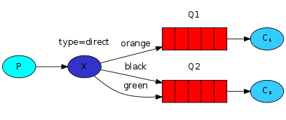
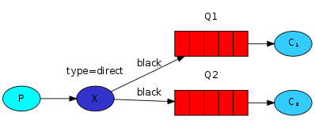
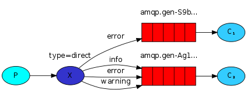
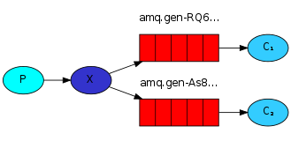
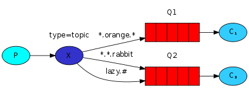

# RabbitMQ 交换器

<!-- TOC -->

- [RabbitMQ 交换器](#rabbitmq-%e4%ba%a4%e6%8d%a2%e5%99%a8)
  - [direct交换器](#direct%e4%ba%a4%e6%8d%a2%e5%99%a8)
  - [fanout交换器](#fanout%e4%ba%a4%e6%8d%a2%e5%99%a8)
  - [topic交换器](#topic%e4%ba%a4%e6%8d%a2%e5%99%a8)
  - [headers交换器](#headers%e4%ba%a4%e6%8d%a2%e5%99%a8)

<!-- /TOC -->

- 官方例子 http://www.rabbitmq.com/getstarted.html

## direct交换器

如上图所示，两个队列绑定到了direct交换器上，第一个队列绑定的 `binding key` 为 `orange` ，第二个队列有两个绑定，分别是 `black` 和 `green` 。

如上图所示，用相同的 `binding key` 绑定到多个队列上是完全OK的。

上图为日志系统所使用的direct交换器场景。

direct交换器的路由算法很简单，一条消息将会进入 `binding key` （队列的绑定） 和消息的 `routing key` 完全匹配的队列。

如果路由键完全匹配的话，消息就被投递到对应的队列。

## fanout交换器

消息通信模式：当你发送一条消息到 `fanout` 交换器时，它会把消息投递给 **所有** 附加在此交换器上的队列。这允许你对单条消息做不同方式的反应。
 
发送时需要提供 `routing_key` ，但是对于 `fanout ` 交换器，它的值将被忽略。

## topic交换器

这类交换器允许你实现有趣的消息通信场景，它使得来自不同源头的消息能够到达同一个队列。

- 单个 `“.”` 把路由键分为几部分
- `“*”` 匹配特定位置的任意文本。
- 为了实现匹配所有规则，你可以实用 `“#”` 字符

## headers交换器

header交换器和direct交换器完全一致，但性能会差很多。因此不太实用，几乎再也用不到了。
