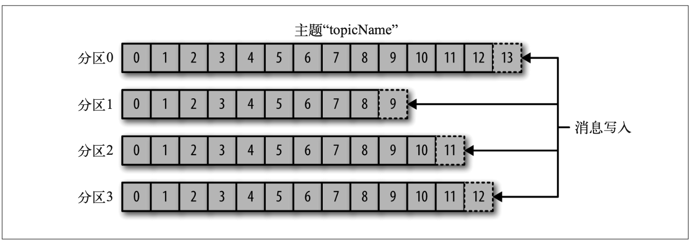

# 主题和分区

Kafka 的消息通过 **主题** 进行分类。主题就好比数据库的表，或者文件系统里的文件夹。主 题可以被分为若干个 **分区** ，一个分区就是一个提交日志。消息以追加的方式写入分区，然 后以先入先出的顺序读取。要注意，由于一个主题一般包含几个分区，因此无法在整个主 题范围内保证消息的顺序，但可以保证消息在单个分区内的顺序。图 1-5 所示的主题有 4 个分区，消息被追加写入每个分区的尾部。Kafka 通过分区来实现数据冗余和伸缩性。分 区可以分布在不同的服务器上，也就是说，一个主题可以横跨多个服务器，以此来提供比 单个服务器更强大的性能。

图 1-5:包含多个分区的主题表示

我们通常会使用流这个词来描述 Kafka 这类系统的数据。很多时候，人们把一个主题的数 据看成一个流，不管它有多少个分区。流是一组从生产者移动到消费者的数据。当我们讨 论流式处理时，一般都是这样描述消息的。Kafka Streams、Apache Samza 和 Storm 这些框 架以实时的方式处理消息，也就是所谓的流式处理。我们可以将流式处理与离线处理进行 比较，比如 Hadoop 就是被设计用于在稍后某个时刻处理大量的数据。第 11 章将会介绍流 式处理。