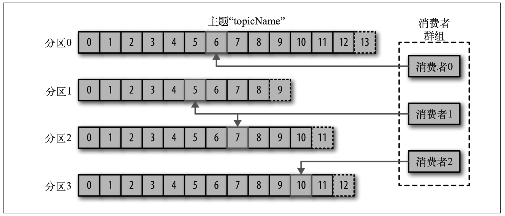

# 生产者和消费者

Kafka 的客户端就是 Kafka 系统的用户，它们被分为两种基本类型:生产者和消费者。除 此之外，还有其他高级客户端 API——用于数据集成的 Kafka Connect API 和用于流式处理 的 Kafka Streams。这些高级客户端 API 使用生产者和消费者作为内部组件，提供了高级的 功能。

## 生产者

**生产者** 创建消息。在其他发布与订阅系统中，生产者可能被称为 **发布者** 或 **写入者** 。一般情 况下，一个消息会被发布到一个特定的主题上。生产者在默认情况下把消息均衡地分布到 主题的所有分区上，而并不关心特定消息会被写到哪个分区。不过，在某些情况下，生产 者会把消息直接写到指定的分区。这通常是通过消息键和分区器来实现的，分区器为键生 成一个散列值，并将其映射到指定的分区上。这样可以保证包含同一个键的消息会被写到 同一个分区上。生产者也可以使用自定义的分区器，根据不同的业务规则将消息映射到分 区。第 3 章将详细介绍生产者。

## 消费者

**消费者** 读取消息。在其他发布与订阅系统中，消费者可能被称为 **订阅者** 或 **读者** 。消费者订 阅一个或多个主题，并按照消息生成的顺序读取它们。消费者通过检查消息的偏移量来区 分已经读取过的消息。 **偏移量** 是另一种元数据，它是一个不断递增的整数值，在创建消息 时，Kafka 会把它添加到消息里。在给定的分区里，每个消息的偏移量都是唯一的。消费 者把每个分区最后读取的消息偏移量保存在 Zookeeper 或 Kafka 上，如果消费者关闭或重 启，它的读取状态不会丢失。

消费者是 **消费者群组** 的一部分，也就是说，会有一个或多个消费者共同读取一个主题。群 组保证每个分区只能被一个消费者使用。图 1-6 所示的群组中，有 3 个消费者同时读取一 个主题。其中的两个消费者各自读取一个分区，另外一个消费者读取其他两个分区。消费 者与分区之间的映射通常被称为消费者对分区的 **所有权关系** 。

通过这种方式，消费者可以消费包含大量消息的主题。而且，如果一个消费者失效，群组 里的其他消费者可以接管失效消费者的工作。第 4 章将详细介绍消费者和消费者群组。

