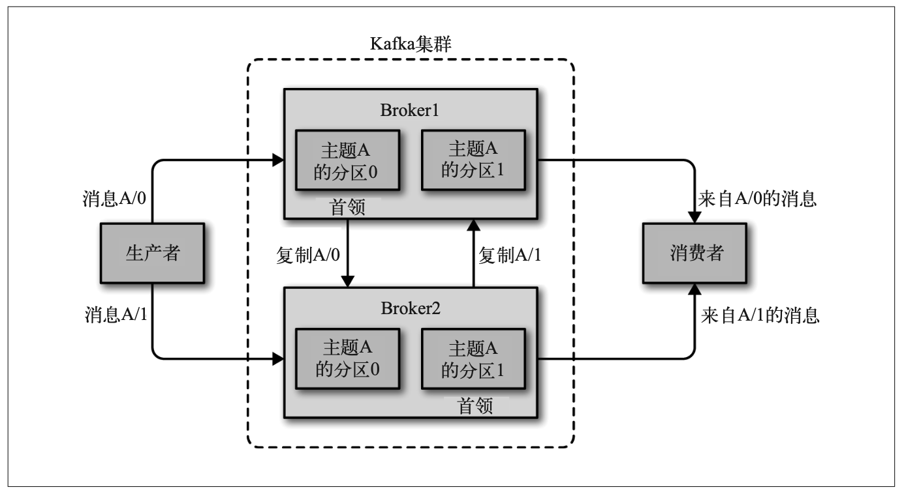
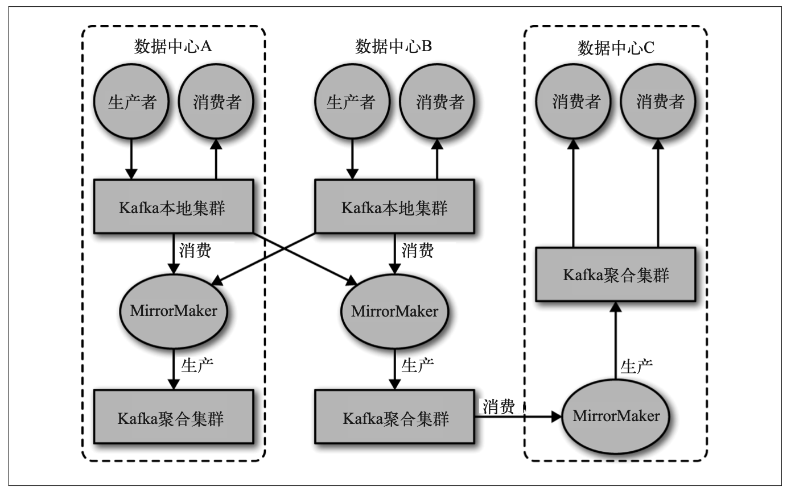

# broker和集群

一个独立的 Kafka 服务器被称为 broker。broker 接收来自生产者的消息，为消息设置偏移量，并提交消息到磁盘保存。broker 为消费者提供服务，对读取分区的请求作出响应，返回已经提交到磁盘上的消息。根据特定的硬件及其性能特征，单个 broker 可以轻松处理数 千个分区以及每秒百万级的消息量。

broker 是 **集群** 的组成部分。每个集群都有一个 broker 同时充当了 **集群控制器** 的角色(自动从集群的活跃成员中选举出来)。控制器负责管理工作，包括将分区分配给 broker 和监控 broker。在集群中，一个分区从属于一个 broker，该 broker 被称为分区的首领。一个分区 可以分配给多个 broker，这个时候会发生分区复制(见图 1-7)。这种复制机制为分区提供 了消息冗余，如果有一个 broker 失效，其他 broker 可以接管领导权。不过，相关的消费者 和生产者都要重新连接到新的首领。第 6 章将详细介绍集群的操作，包括分区复制。

图 1-7: 集群里的分区复制

**保留消息** (在一定期限内)是 Kafka 的一个重要特性。Kafka broker 默认的消息保留策略 是这样的:要么保留一段时间(比如 7 天)，要么保留到消息达到一定大小的字节数(比 如 1GB)。当消息数量达到这些上限时，旧消息就会过期并被删除，所以在任何时刻，可 用消息的总量都不会超过配置参数所指定的大小。主题可以配置自己的保留策略，可以将 消息保留到不再使用它们为止。例如，用于跟踪用户活动的数据可能需要保留几天，而应用程序的度量指标可能只需要保留几个小时。可以通过配置把主题当作 **紧凑型日志** ，只有 最后一个带有特定键的消息会被保留下来。这种情况对于变更日志类型的数据来说比较适用，因为人们只关心最后时刻发生的那个变更。

## 多集群

随着 Kafka 部署数量的增加，基于以下几点原因，最好使用多个集群。

- 数据类型分离
- 安全需求隔离
- 多数据中心(灾难恢复)

如果使用多个数据中心，就需要在它们之间复制消息。这样，在线应用程序才可以访问到 多个站点的用户活动信息。例如，如果一个用户修改了他们的资料信息，不管从哪个数据 中心都应该能看到这些改动。或者多个站点的监控数据可以被聚集到一个部署了分析程序 和告警系统的中心位置。不过，Kafka 的消息复制机制只能在单个集群里进行，不能在多个集群之间进行。

Kafka 提供了一个叫作 MirrorMaker 的工具，可以用它来实现集群间的消息复制。 MirrorMaker 的核心组件包含了一个生产者和一个消费者，两者之间通过一个队列相连。消费者从一个集群读取消息，生产者把消息发送到另一个集群上。图 1-8 展示了一个使 用 MirrorMaker 的例子，两个“本地”集群的消息被聚集到一个“聚合”集群上，然后将 该集群复制到其他数据中心。不过，这种方式在创建复杂的数据管道方面显得有点力不从 心。第 7 章将详细讨论这些案例。

