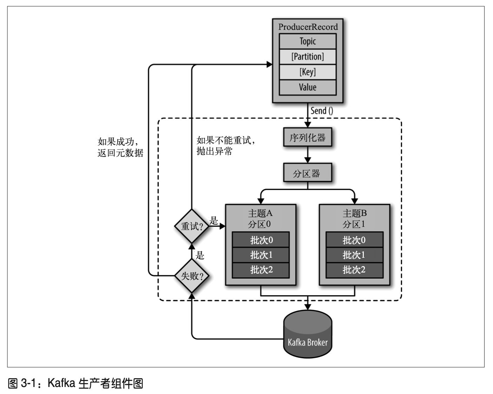

# 生产者

- [生产者](#生产者)
  - [生产者概览](#生产者概览)
  - [创建Kafka生产者](#创建kafka生产者)
  - [发送消息到Kafka](#发送消息到kafka)
    - [同步发送消息](#同步发送消息)
    - [异步发送消息](#异步发送消息)
  - [生产者的配置](#生产者的配置)

## 生产者概览

尽管生产者 API 使用起来很简单，但消息的发送过程还是有点复杂的。图 3-1 展示了向
Kafka 发送消息的主要步骤。




我们从创建一个 ProducerRecord 对象开始，ProducerRecord 对象需要包含目标主题和要发送的内容。我们还可以指定键或分区。在发送 ProducerRecord 对象时，生产者要先把键和值对象序列化成字节数组，这样它们才能够在网络上传输。

接下来，数据被传给分区器。如果之前在 ProducerRecord 对象里指定了分区，那么分区器就不会再做任何事情，直接把指定的分区返回。如果没有指定分区，那么分区器会根据 ProducerRecord 对象的键来选择一个分区。选好分区以后，生产者就知道该往哪个主题和分区发送这条记录了。紧接着，这条记录被添加到一个记录批次里，这个批次里的所有消 息会被发送到相同的主题和分区上。有一个独立的线程负责把这些记录批次发送到相应的 broker 上。

服务器在收到这些消息时会返回一个响应。如果消息成功写入 Kafka，就返回一个 RecordMetaData 对象，它包含了主题和分区信息，以及记录在分区里的偏移量。如果写入 失败，则会返回一个错误。生产者在收到错误之后会尝试重新发送消息，几次之后如果还是失败，就返回错误信息。

## 创建Kafka生产者


要往 Kafka 写入消息，首先要创建一个生产者对象，并设置一些属性。Kafka 生产者有 3 个必选的属性。

`bootstrap.servers`

该属性指定 broker 的地址清单，地址的格式为 host:port。清单里不需要包含所有的 broker 地址，生产者会从给定的 broker 里查找到其他 broker 的信息。不过建议至少要提供两个 broker 的信息，一旦其中一个宕机，生产者仍然能够连接到集群上。

`key.serializer`

broker 希望接收到的消息的键和值都是字节数组。生产者接口允许使用参数化类型，因 此可以把 Java 对象作为键和值发送给 broker。这样的代码具有良好的可读性，不过生产者需要知道如何把这些 Java 对象转换成字节数组。key.serializer 必须被设置为一个实现了 org.apache.kafka.common.serialization.Serializer 接口的类，生产者会使 用这个类把键对象序列化成字节数组。Kafka 客户端默认提供了 ByteArraySerializer
(这个只做很少的事情)、StringSerializer 和 IntegerSerializer，因此，如果你只 使用常见的几种 Java 对象类型，那么就没必要实现自己的序列化器。要注意，key. serializer 是必须设置的，就算你打算只发送值内容。

`value.serializer`

与 key.serializer 一样，value.serializer 指定的类会将值序列化。如果键和值都是字符串，可以使用与 key.serializer 一样的序列化器。如果键是整数类型而值是字符串， 那么需要使用不同的序列化器。
下面的代码片段演示了如何创建一个新的生产者，这里只指定了必要的属性，其他使用默 认设置。


``` java

// ➊
private Properties kafkaProps = new Properties(); 
kafkaProps.put("bootstrap.servers", "broker1:9092,broker2:9092");
// ➋
kafkaProps.put("key.serializer", "org.apache.kafka.common.serialization.StringSerializer"); 
kafkaProps.put("value.serializer","org.apache.kafka.common.serialization.StringSerializer");

// ➌
producer = new KafkaProducer<String, String>(kafkaProps); 
```

- ➊ 新建一个 Properties 对象。
- ➋ 因为我们打算把键和值定义成字符串类型，所以使用内置的 StringSerializer。
- ➌ 在这里我们创建了一个新的生产者对象，并为键和值设置了恰当的类型，然后把 Properties 对象传给它。

这个接口很简单，通过配置生产者的不同属性就可以很大程度地控制它的行为。Kafka 的文档涵盖了所有的配置参数，我们将在这一章的后面部分介绍其中几个比较重要的参数。

实例化生产者对象后，接下来就可以开始发送消息了。发送消息主要有以下 3 种方式。


**发送并忘记(fire-and-forget)**


我们把消息发送给服务器，但并不关心它是否正常到达。大多数情况下，消息会正常到 达，因为 Kafka 是高可用的，而且生产者会自动尝试重发。不过，使用这种方式有时候也会丢失一些消息。

**同步发送**

我们使用 send() 方法发送消息，它会返回一个 Future 对象，调用 get() 方法进行等待， 就可以知道消息是否发送成功。

**异步发送**

我们调用 send() 方法，并指定一个回调函数，服务器在返回响应时调用该函数。 

在下面的几个例子中，我们会介绍如何使用上述几种方式来发送消息，以及如何处理可能发生的异常情况。

本章的所有例子都使用单线程，但其实生产者是可以使用多线程来发送消息的。刚开始的 时候可以使用单个消费者和单个线程。如果需要更高的吞吐量，可以在生产者数量不变的 前提下增加线程数量。如果这样做还不够，可以增加生产者数量。

## 发送消息到Kafka


``` java
// ➊
ProducerRecord<String, String> record =
             new ProducerRecord<>("CustomerCountry", "Precision Products", "France");
try { 
    // ➋
    producer.send(record);
} catch (Exception e) { 
    // ➌
    e.printStackTrace();
}
```

- ➊ 生产者的 send() 方法将 ProducerRecord 对象作为参数，所以我们要先创建一个 ProducerRecord 对象。ProducerRecord 有多个构造函数，稍后我们会详细讨论。这里使 用其中一个构造函数，它需要目标主题的名字和要发送的键和值对象，它们都是字符串。键和值对象的类型必须与序列化器和生产者对象相匹配。
- ➋ 我们使用生产者的 send() 方法发送 ProducerRecord 对象。从生产者的架构图里可以看到，消息先是被放进缓冲区，然后使用单独的线程发送到服务器端。send() 方法会返 回一个包含 RecordMetadata 的 Future 对象，不过因为我们会忽略返回值，所以无法知 道消息是否发送成功。如果不关心发送结果，那么可以使用这种发送方式。比如，记录 Twitter 消息日志，或记录不太重要的应用程序日志。
- ➌ 我们可以忽略发送消息时可能发生的错误或在服务器端可能发生的错误，但在发送消息之前，生产者还是有可能发生其他的异常。这些异常有可能是 SerializationException (说明序列化消息失败)、BufferExhaustedException 或 TimeoutException(说明缓冲区已满)，又或者是 InterruptException(说明发送线程被中断)。


### 同步发送消息

最简单的同步发送消息方式如下所示。

``` java
 ProducerRecord<String, String> record =
              new ProducerRecord<>("CustomerCountry", "Precision Products", "France");
try {
    // ➊
    producer.send(record).get();
} catch (Exception e) { 
    // ➋
    e.printStackTrace();
}

```

- ➊ 在这里，producer.send() 方法先返回一个 Future 对象，然后调用 Future 对象的 get() 方法等待 Kafka 响应。如果服务器返回错误，get() 方法会抛出异常。如果没有发生错 误，我们会得到一个 RecordMetadata 对象，可以用它获取消息的偏移量。
- ➋ 如果在发送数据之前或者在发送过程中发生了任何错误，比如 broker 返回了一个不允 许重发消息的异常或者已经超过了重发的次数，那么就会抛出异常。我们只是简单地把异常信息打印出来。

KafkaProducer 一般会发生两类错误。其中一类是可重试错误，这类错误可以通过重发消息 来解决。比如对于连接错误，可以通过再次建立连接来解决，“无主(no leader)”错误则可 以通过重新为分区选举首领来解决。KafkaProducer 可以被配置成自动重试，如果在多次重 试后仍无法解决问题，应用程序会收到一个重试异常。另一类错误无法通过重试解决，比如“消息太大”异常。对于这类错误，KafkaProducer 不会进行任何重试，直接抛出异常。

### 异步发送消息

假设消息在应用程序和 Kafka 集群之间一个来回需要 10ms。如果在发送完每个消息后都 等待回应，那么发送 100 个消息需要 1 秒。但如果只发送消息而不等待响应，那么发送 100 个消息所需要的时间会少很多。大多数时候，我们并不需要等待响应——尽管 Kafka 会把目标主题、分区信息和消息的偏移量发送回来，但对于发送端的应用程序来说不是必需的。不过在遇到消息发送失败时，我们需要抛出异常、记录错误日志，或者把消息写入 “错误消息”文件以便日后分析。

为了在异步发送消息的同时能够对异常情况进行处理，生产者提供了回调支持。下面是使 用回调的一个例子。

``` java
//➊ 
private class DemoProducerCallback implements Callback {
    @Override
    public void onCompletion(RecordMetadata recordMetadata, Exception e) {
        if (e != null) {
            // ➋ 
            e.printStackTrace();
        }
    } 
}

// ➌
ProducerRecord<String, String> record =
    new ProducerRecord<>("CustomerCountry", "Biomedical Materials", "USA");
//➍
producer.send(record, new DemoProducerCallback());

```

- ➊ 为了使用回调，需要一个实现了 org.apache.kafka.clients.producer.Callback 接口的 类，这个接口只有一个 onCompletion 方法。
- ➋ 如果 Kafka 返回一个错误，onCompletion 方法会抛出一个非空(non null)异常。这里 我们只是简单地把它打印出来，但是在生产环境应该有更好的处理方式。
- ➌ 记录与之前的一样。
- ➍ 在发送消息时传进去一个回调对象。


## 生产者的配置

到目前为止，我们只介绍了生产者的几个必要配置参数——bootstrap.servers API 以及序列化器。

生产者还有很多可配置的参数，在 Kafka 文档里都有说明，它们大部分都有合理的默认 值，所以没有必要去修改它们。不过有几个参数在内存使用、性能和可靠性方面对生产者 影响比较大，接下来我们会一一说明。

**1. `acks`**

acks 参数指定了必须要有多少个分区副本收到消息，生产者才会认为消息写入是成功的。 这个参数对消息丢失的可能性有重要影响。该参数有如下选项。

- 如果 acks=0，生产者在成功写入消息之前不会等待任何来自服务器的响应。也就是说， 如果当中出现了问题，导致服务器没有收到消息，那么生产者就无从得知，消息也就丢 失了。不过，因为生产者不需要等待服务器的响应，所以它可以以网络能够支持的最大 速度发送消息，从而达到很高的吞吐量。
- 如果 acks=1，只要集群的首领节点收到消息，生产者就会收到一个来自服务器的成功 响应。如果消息无法到达首领节点(比如首领节点崩溃，新的首领还没有被选举出来)， 生产者会收到一个错误响应，为了避免数据丢失，生产者会重发消息。不过，如果一个 没有收到消息的节点成为新首领，消息还是会丢失。这个时候的吞吐量取决于使用的是同步发送还是异步发送。如果让发送客户端等待服务器的响应(通过调用 Future 对象 的 get() 方法)，显然会增加延迟(在网络上传输一个来回的延迟)。如果客户端使用回 调，延迟问题就可以得到缓解，不过吞吐量还是会受发送中消息数量的限制(比如，生 产者在收到服务器响应之前可以发送多少个消息)。
- 如果 acks=all，只有当所有参与复制的节点全部收到消息时，生产者才会收到一个来自服务器的成功响应。这种模式是最安全的，它可以保证不止一个服务器收到消息，就算 有服务器发生崩溃，整个集群仍然可以运行(第 5 章将讨论更多的细节)。不过，它的 延迟比 acks=1 时更高，因为我们要等待不只一个服务器节点接收消息。

**2. `buffer.memory`**

该参数用来设置生产者内存缓冲区的大小，生产者用它缓冲要发送到服务器的消息。如果 应用程序发送消息的速度超过发送到服务器的速度，会导致生产者空间不足。这个时候， send() 方法调用要么被阻塞，要么抛出异常，取决于如何设置 block.on.buffer.full 参数
(在 0.9.0.0 版本里被替换成了 max.block.ms，表示在抛出异常之前可以阻塞一段时间)。 

**3. `compression.type`**

默认情况下，消息发送时不会被压缩。该参数可以设置为 snappy、gzip 或 lz4，它指定了 消息被发送给 broker 之前使用哪一种压缩算法进行压缩。snappy 压缩算法由 Google 发明， 它占用较少的 CPU，却能提供较好的性能和相当可观的压缩比，如果比较关注性能和网 络带宽，可以使用这种算法。gzip 压缩算法一般会占用较多的 CPU，但会提供更高的压缩 比，所以如果网络带宽比较有限，可以使用这种算法。使用压缩可以降低网络传输开销和 存储开销，而这往往是向 Kafka 发送消息的瓶颈所在。

**4. `retries`**

生产者从服务器收到的错误有可能是临时性的错误(比如分区找不到首领)。在这种情况 下，retries 参数的值决定了生产者可以重发消息的次数，如果达到这个次数，生产者会 放弃重试并返回错误。默认情况下，生产者会在每次重试之间等待 100ms，不过可以通过 retry.backoff.ms 参数来改变这个时间间隔。建议在设置重试次数和重试时间间隔之前， 先测试一下恢复一个崩溃节点需要多少时间(比如所有分区选举出首领需要多长时间)， 让总的重试时间比 Kafka 集群从崩溃中恢复的时间长，否则生产者会过早地放弃重试。不 过有些错误不是临时性错误，没办法通过重试来解决(比如“消息太大”错误)。一般情 况下，因为生产者会自动进行重试，所以就没必要在代码逻辑里处理那些可重试的错误。 你只需要处理那些不可重试的错误或重试次数超出上限的情况。

**5. `batch.size`**

当有多个消息需要被发送到同一个分区时，生产者会把它们放在同一个批次里。该参数指 定了一个批次可以使用的内存大小，按照字节数计算(而不是消息个数)。当批次被填满， 批次里的所有消息会被发送出去。不过生产者并不一定都会等到批次被填满才发送，半满 的批次，甚至只包含一个消息的批次也有可能被发送。所以就算把批次大小设置得很大， 也不会造成延迟，只是会占用更多的内存而已。但如果设置得太小，因为生产者需要更频 繁地发送消息，会增加一些额外的开销。
  Kafka生产者——向Kafka写入数据 | 37

**6. `linger.ms`**

该参数指定了生产者在发送批次之前等待更多消息加入批次的时间。KafkaProducer 会在 批次填满或 linger.ms 达到上限时把批次发送出去。默认情况下，只要有可用的线程，生 产者就会把消息发送出去，就算批次里只有一个消息。把 linger.ms 设置成比 0 大的数， 让生产者在发送批次之前等待一会儿，使更多的消息加入到这个批次。虽然这样会增加延 迟，但也会提升吞吐量(因为一次性发送更多的消息，每个消息的开销就变小了)。
1. client.id
该参数可以是任意的字符串，服务器会用它来识别消息的来源，还可以用在日志和配额指 标里。
8. max.in.flight.requests.per.connection
该参数指定了生产者在收到服务器响应之前可以发送多少个消息。它的值越高，就会占用 越多的内存，不过也会提升吞吐量。把它设为 1 可以保证消息是按照发送的顺序写入服务 器的，即使发生了重试。
9. timeout.ms、request.timeout.ms 和 metadata.fetch.timeout.ms
request.timeout.ms 指定了生产者在发送数据时等待服务器返回响应的时间，metadata. fetch.timeout.ms 指定了生产者在获取元数据(比如目标分区的首领是谁)时等待服务器 返回响应的时间。如果等待响应超时，那么生产者要么重试发送数据，要么返回一个错误
(抛出异常或执行回调)。timeout.ms 指定了 broker 等待同步副本返回消息确认的时间，与 asks 的配置相匹配——如果在指定时间内没有收到同步副本的确认，那么 broker 就会返回 一个错误。
10. max.block.ms
该参数指定了在调用 send() 方法或使用 partitionsFor() 方法获取元数据时生产者的阻塞 时间。当生产者的发送缓冲区已满，或者没有可用的元数据时，这些方法就会阻塞。在阻 塞时间达到 max.block.ms 时，生产者会抛出超时异常。
11. max.request.size
该参数用于控制生产者发送的请求大小。它可以指能发送的单个消息的最大值，也可以指 单个请求里所有消息总的大小。例如，假设这个值为 1MB，那么可以发送的单个最大消 息为 1MB，或者生产者可以在单个请求里发送一个批次，该批次包含了 1000 个消息，每 个消息大小为 1KB。另外，broker 对可接收的消息最大值也有自己的限制(message.max. bytes)，所以两边的配置最好可以匹配，避免生产者发送的消息被 broker 拒绝。
12. receive.buffer.bytes 和 send.buffer.bytes
这两个参数分别指定了 TCP socket 接收和发送数据包的缓冲区大小。如果它们被设为 -1， 就使用操作系统的默认值。如果生产者或消费者与 broker 处于不同的数据中心，那么可以 适当增大这些值，因为跨数据中心的网络一般都有比较高的延迟和比较低的带宽。