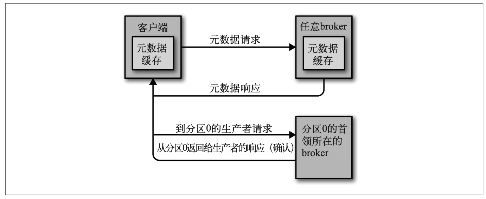

# 处理请求

## 元数据请求

**客户端怎么知道该往哪里发送请求呢?**

客户端使用了另一种请求类型，也就是元数据 请求。这种请求包含了客户端感兴趣的主题列表。服务器端的响应消息里指明了这些主题 所包含的分区、每个分区都有哪些副本，以及哪个副本是首领。元数据请求可以发送给任 意一个 broker，因为所有 broker 都缓存了这些信息。

一般情况下，客户端会把这些信息缓存起来，并直接往目标 broker 上发送生产请求和获取请求。它们需要时不时地通过发送元数据请求来刷新这些信息(刷新的时间间隔通过 `metadata.max.age.ms` 参数来配置)，从而知道元数据是否发生了变更——比如，在新 broker 加入集群时，部分副本会被移动到新的 broker 上(如图 5-2 所示)。另外，如果客户端收到“非首领”错误，它会在尝试重发请求之前先刷新元数据，因为这个错误说明了客户端正在使用过期的元数据信息，之前的请求被发到了错误的 broker 上。

