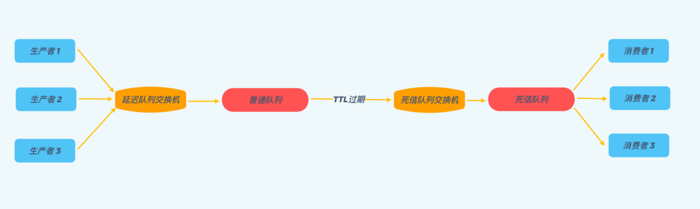

# 延迟队列

<!-- TOC -->

- [延迟队列](#延迟队列)
  - [前言](#前言)
  - [延迟队列定义](#延迟队列定义)
  - [应用场景](#应用场景)
  - [实现方案 Redis ZSet](#实现方案-redis-zset)
  - [实现方案 RabbitMQ](#实现方案-rabbitmq)
    - [死信队列](#死信队列)
    - [消息生存时间 TTL](#消息生存时间-ttl)
    - [RabbitMQ 实现延迟队列](#rabbitmq-实现延迟队列)
  - [TimeWheel](#timewheel)
    - [时间轮](#时间轮)
    - [添加延迟任务](#添加延迟任务)
    - [多层时间轮](#多层时间轮)
  - [总结](#总结)

<!-- /TOC -->

## 前言

延迟队列是我们日常开发过程中，经常接触并需要使用到的一种技术方案。前些时间在开发业务需求时，我也遇到了一个需要使用到延迟消息队列的需求场景，因此我也在网上调研了一系列不同的延迟队列的实现方案，在此进行了一个总结并且给大家进行分享。


## 延迟队列定义

首先，队列这种数据结构相信大家都不陌生，它是一种先进先出的数据结构。普通队列中的元素是有序的，先进入队列中的元素会被优先取出进行消费；

延时队列相比于普通队列最大的区别就体现在其延时的属性上，普通队列的元素是先进先出，按入队顺序进行处理，而延时队列中的元素在入队时会指定一个延迟时间，表示其希望能够在经过该指定时间后处理。从某种意义上来讲，延迟队列的结构并不像一个队列，而更像是一种以时间为权重的有序堆结构。

## 应用场景

我在开发业务需求时遇到的使用场景是这样的，用户可以在小程序中订阅不同的微信或者 QQ 的模板消息，产品同学可以在小程序的管理端新建消息推送计划，当到达指定的时间节点的时候给所有订阅模板消息的用户进行消息推送。

如果仅仅是服务单一的小程序，那也许起个定时任务，或者甚至人工的定时去执行能够最便捷最快速的去完成这项需求，但我们希望能够抽象出一个消息订阅的模块服务出来给所有业务使用，这时候就需要一种通用的系统的解决方案，这时候便需要使用到延迟队列了。

除了上述我所遇到的这样的典型的需求以外，延迟队列的应用场景其实也非常的广泛，比如说以下的场景：

1. 新建的订单，如果用户在 15 分钟内未支付，则自动取消。
1. 公司的会议预定系统，在会议预定成功后，会在会议开始前半小时通知所有预定该会议的用户。
1. 安全工单超过 24 小时未处理，则自动拉企业微信群提醒相关责任人。
1. 用户下单外卖以后，距离超时时间还有 10 分钟时提醒外卖小哥即将超时。

对于数据量比较少并且时效性要求不那么高的场景，一种比较简单的方式是轮询数据库，比如每秒轮询一下数据库中所有数据，处理所有到期的数据，比如如果我是公司内部的会议预定系统的开发者，我可能就会采用这种方案，因为整个系统的数据量必然不会很大并且会议开始前提前 30 分钟提醒与提前 29 分钟提醒的差别并不大。

但是如果需要处理的数据量比较大实时性要求比较高，比如淘宝每天的所有新建订单 15 分钟内未支付的自动超时，数量级高达百万甚至千万，这时候如果你还敢轮询数据库怕是要被你老板打死，不被老板打死估计也要被运维同学打死。

这种场景下，就需要使用到我们今天的主角 —— 延迟队列了。延迟队列为我们提供了一种高效的处理大量需要延迟消费消息的解决方案。那么话不多说，下面我们就来看一下几种常见的延迟队列的解决方案以及他们各自的优缺点。

## 实现方案 Redis ZSet

我们知道 Redis 有一个有序集合的数据结构 ZSet，ZSet 中每个元素都有一个对应 Score，ZSet 中所有元素是按照其 Score 进行排序的。


那么我们可以通过以下这几个操作使用 Redis 的 ZSet 来实现一个延迟队列：

1. 入队操作：ZADD KEY timestamp task, 我们将需要处理的任务，按其需要延迟处理时间作为 Score 加入到 ZSet 中。Redis 的 ZAdd 的时间复杂度是O(logN)，N是 ZSet 中元素个数，因此我们能相对比较高效的进行入队操作。

2. 起一个进程定时（比如每隔一秒）通过ZREANGEBYSCORE方法查询 ZSet 中 Score 最小的元素，具体操作为：ZRANGEBYSCORE KEY -inf +inf limit 0 1 WITHSCORES。查询结果有两种情况：
   
- a. 查询出的分数小于等于当前时间戳，说明到这个任务需要执行的时间了，则去异步处理该任务；
- b. 查询出的分数大于当前时间戳，由于刚刚的查询操作取出来的是分数最小的元素，所以说明 ZSet 中所有的任务都还没有到需要执行的时间，则休眠一秒后继续查询；

同样的，ZRANGEBYSCORE操作的时间复杂度为 `O(logN + M)` ，其中N为 ZSet 中元素个数，M为查询的元素个数，因此我们定时查询操作也是比较高效的。

这里从网上搬运了一套 Redis 实现延迟队列的后端架构，其在原来 Redis 的 ZSet 实现上进行了一系列的优化，使得整个系统更稳定、更健壮，能够应对高并发场景，并且具有更好的可扩展性，是一个挺不错的架构设计，其整体架构图如下：


其核心设计思路：

1. 将延迟的消息任务通过 hash 算法路由至不同的 Redis Key 上，这样做有两大好处：

    - a. 避免了当一个 KEY 在存储了较多的延时消息后，入队操作以及查询操作速度变慢的问题（两个操作的时间复杂度均为O(logN)）。
    - b. 系统具有了更好的横向可扩展性，当数据量激增时，我们可以通过增加 Redis Key 的数量来快速的扩展整个系统，来抗住数据量的增长。

2. 每个 Redis Key 都对应建立一个处理进程，称为 Event 进程，通过上述步骤 2 中所述的 ZRANGEBYSCORE 方法轮询 Key，查询是否有待处理的延迟消息。
3. 所有的 Event 进程只负责分发消息，具体的业务逻辑通过一个额外的消息队列异步处理，这么做的好处也是显而易见的：

    - a. 一方面，Event 进程只负责分发消息，那么其处理消息的速度就会非常快，就不太会出现因为业务逻辑复杂而导致消息堆积的情况。
    - b. 另一方面，采用一个额外的消息队列后，消息处理的可扩展性也会更好，我们可以通过增加消费者进程数量来扩展整个系统的消息处理能力。

4. Event 进程采用 Zookeeper 选主单进程部署的方式，避免 Event 进程宕机后，Redis Key 中消息堆积的情况。一旦 Zookeeper 的 leader 主机宕机，Zookeeper 会自动选择新的 leader 主机来处理 Redis Key 中的消息。

从上述的讨论中我们可以看到，通过 Redis Zset 实现延迟队列是一种理解起来较为直观，可以快速落地的方案。并且我们可以依赖 Redis 自身的持久化来实现持久化，使用 Redis 集群来支持高并发和高可用，是一种不错的延迟队列的实现方案。

## 实现方案 RabbitMQ

RabbitMQ 本身并不直接提供对延迟队列的支持，我们依靠 RabbitMQ 的 **TTL** 以及 **死信队列** 功能，来实现延迟队列的效果。那就让我们首先来了解一下，RabbitMQ 的死信队列以及 TTL 功能。

### 死信队列

死信队列实际上是一种 RabbitMQ 的消息处理机制，当 RabbmitMQ 在生产和消费消息的时候，消息遇到如下的情况，就会变成“死信”：

1. 消息被拒绝basic.reject/ basic.nack 并且不再重新投递 requeue=false
1. 消息超时未消费，也就是 TTL 过期了
1. 消息队列到达最大长度

消息一旦变成一条死信，便会被重新投递到死信交换机（Dead-Letter-Exchange），然后死信交换机根据绑定规则转发到对应的死信队列上，监听该队列就可以让消息被重新消费。

### 消息生存时间 TTL

TTL（Time-To-Live）是 RabbitMQ 的一种高级特性，表示了一条消息的最大生存时间，单位为毫秒。如果一条消息在 TTL 设置的时间内没有被消费，那么它就会变成一条死信，进入我们上面所说的死信队列。

有两种不同的方式可以设置消息的 TTL 属性，一种方式是直接在创建队列的时候设置整个队列的 TTL 过期时间，所有进入队列的消息，都被设置成了统一的过期时间，一旦消息过期，马上就会被丢弃，进入死信队列，参考代码如下：

```
Map<String, Object> args = new HashMap<String, Object>();
args.put("x-message-ttl", 6000);
channel.queueDeclare(queueName, durable, exclusive, autoDelete, args);
```

在延迟队列的延迟时间为固定值的时候，比较适合使用这种方式。

另一种方式是针对单条消息设置，参考代码如下，该消息被设置了 6 秒的过期时间：

```
AMQP.BasicProperties.Builder builder = new AMQP.BasicProperties.Builder();
builder.expiration("6000");
AMQP.BasicProperties properties = builder.build();
channel.basicPublish(exchangeName, routingKey, mandatory, properties, "msg content".getBytes());
```

如果需要不同的消息设置不同的延迟时间，上面针对队列的 TTL 设置便无法满足我们的需求，需要使用这种针对单个消息的 TTL 设置。

不过需要注意的是，使用这种方式设置的 TTL，消息可能不会按时死亡，因为 RabbitMQ 只会检查第一个消息是否过期。比如这种情况，第一个消息设置了 20s 的 TTL，第二个消息设置了 10s 的 TTL，那么 RabbitMQ 会等到第一个消息过期之后，才会让第二个消息过期。

解决这个问题的方法也很简单，只需要安装 RabbitMQ 的一个插件即可：

https://www.rabbitmq.com/community-plugins.html

安装好这个插件后，所有的消息就都能按照被设置的 TTL 过期了。

### RabbitMQ 实现延迟队列

好了，介绍完 RabbitMQ 的死信队列以及 TTL 这两种特性之后，我们离实现延迟队列就只差一步之遥了。

聪明的读者可能已经发现了，TTL 不就是延迟队列中消息要延迟的时间么？如果我们把需要延迟的消息，将 TTL 设置为其延迟时间，投递到 RabbitMQ 的普通队列中，一直不去消费它，那么经过 TTL 的时间后，消息就会自动被投递到死信队列，这时候我们使用消费者进程实时地去消费死信队列中的消息，不就实现了延迟队列的效果。

从下图可以直观的看出使用 RabbitMQ 实现延迟队列的整体流程：




使用 RabbitMQ 来实现延迟队列，我们可以很好的利用一些 RabbitMQ 的特性，比如消息可靠发送、消息可靠投递、死信队列来保障消息至少被消费一次以及未被正确处理的消息不会被丢弃。另外，通过 RabbitMQ 集群的特性，可以很好的解决单点故障问题，不会因为单个节点挂掉导致延迟队列不可用或者消息丢失。

## TimeWheel

TimeWheel 时间轮算法，是一种实现延迟队列的巧妙且高效的算法，被应用在 Netty，Zookeeper，Kafka 等各种框架中。

### 时间轮


如上图所示，时间轮是一个存储延迟消息的环形队列，其底层采用数组实现，可以高效循环遍历。这个环形队列中的每个元素对应一个延迟任务列表，这个列表是一个双向环形链表，链表中每一项都代表一个需要执行的延迟任务。

时间轮会有表盘指针，表示时间轮当前所指时间，随着时间推移，该指针会不断前进，并处理对应位置上的延迟任务列表。

### 添加延迟任务

由于时间轮的大小固定，并且时间轮中每个元素都是一个双向环形链表，我们可以在 `O(1)` 的时间复杂度下向时间轮中添加延迟任务。

如下图，例如我们有一个这样的时间轮，在表盘指针指向当前时间为 2 时，我们需要新添加一个延迟 3 秒的任务，我们可以快速计算出延迟任务在时间轮中所对应的位置为 5，并添加到位置 5 上任务列表尾部。


### 多层时间轮

到现在为止一切都非常棒，但是细心的同学可能发现了，上面的时间轮的大小是固定的，只有 12 秒。如果此时我们有一个需要延迟 200 秒的任务，我们应该怎么处理呢？直接扩充整个时间轮的大小吗？这显然不可取，因为这样做的话我们就需要维护一个非常非常大的时间轮，内存是不可接受的，而且底层数组大了之后寻址效率也会降低，影响性能。

为此，Kafka 引入了多层时间轮的概念。其实多层时间轮的概念和我们的机械表上时针、分针、秒针的概念非常类似，当仅使用秒针无法表示当前时间时，就使用分针结合秒针一起表示。同样的，当任务的到期时间超过了当前时间轮所表示的时间范围时，就会尝试添加到上层时间轮中，如下图所示：


第一层时间轮整个时间轮所表示时间范围是 0-12 秒，第二层时间轮每格能表示的时间范围是整个第一层时间轮所表示的范围也就是 12 秒，所以整个第二层时间轮能表示的时间范围即 12*12=144 秒，依次类推第三层时间轮能表示的范围是 1728 秒，第四层为 20736 秒等等。

比如现在我们需要添加一个延时为 200 秒的延迟消息，我们发现其已经超过了第一层时间轮能表示的时间范围，我们就需要继续往上层时间轮看，将其添加在第二层时间轮 200/12 = 17 的位置，然后我们发现 17 也超过了第二次时间轮的表示范围，那么我们就需要继续往上层看，将其添加在第三层时间轮的 17/12 = 2 的位置。

Kafka 中时间轮算法添加延迟任务以及推动时间轮滚动的核心流程如下，其中 Bucket 即时间轮中的延迟任务队列，并且 Kafka 引入的 DelayQueue 解决了多数 Bucket 为空导致的时间轮滚动效率低下的问题：


使用时间轮实现的延迟队列，能够支持大量任务的高效触发。并且在 Kafka 的时间轮算法的实现方案中，还引入了 DelayQueue，使用 DelayQueue 来推送时间轮滚动，而延迟任务的添加与删除操作都放在时间轮中，这样的设计大幅提升了整个延迟队列的执行效率。

## 总结

延迟队列在我们日常开发中应用非常广泛，本文介绍了三种不同的实现延迟队列的方案，三种方案各自有各自的特点，例如 Redis 的实现方案理解起来最为简单，能够快速落地，但 Redis 毕竟是基于内存的，虽然有数据持久化方案，但还是有数据丢失的可能性。而 RabbitMQ 的实现方案，由于 RabbitMQ 本身的消息可靠发送、消息可靠投递、死信队列等特性，可以保障消息至少被消费一次以及未被正确处理的消息不会被丢弃，让消息的可靠性有了保障。最后 Kafka 的时间轮算法，个人觉得是三种实现方案中最难理解但也不失为一种非常巧妙实现方案。最后， 希望以上这些内容，能帮助大家在实现自己的延迟队列时提供一点思路。

> 作者：xiewang，腾讯 IEG 运营开发工程师