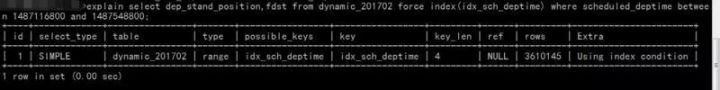

# SQL 优化

<!-- TOC -->

- [SQL 优化](#sql-优化)
    - [2. SQL语句中IN包含的值不应过多](#2-sql语句中in包含的值不应过多)
    - [3. SELECT语句务必指明字段名称](#3-select语句务必指明字段名称)
    - [4. 如果限制条件中其他字段没有索引，尽量少用or](#4-如果限制条件中其他字段没有索引尽量少用or)
    - [5. 尽量用UnionAll代替union](#5-尽量用unionall代替union)
    - [6. 随机排序OrderByRand](#6-随机排序orderbyrand)
    - [7. 区分In和Exists、NotIn和NotExists](#7-区分in和existsnotin和notexists)
    - [8. 使用合理的分页方式以提高分页的效率](#8-使用合理的分页方式以提高分页的效率)
    - [9. 分段查询](#9-分段查询)
    - [10. 不建议使用前缀模糊查询](#10-不建议使用前缀模糊查询)
    - [11. 避免在where子句中对字段进行表达式操作](#11-避免在where子句中对字段进行表达式操作)
    - [12. 避免隐式类型转换](#12-避免隐式类型转换)
    - [13. 对于联合索引来说，要遵守最左前缀法则](#13-对于联合索引来说要遵守最左前缀法则)
    - [14. 必要时可以使用force index来强制查询走某个索引](#14-必要时可以使用force-index来强制查询走某个索引)
    - [15. 注意范围查询语句](#15-注意范围查询语句)
    - [16. 关于JOIN优化](#16-关于join优化)

<!-- /TOC -->

## 2. SQL语句中IN包含的值不应过多

MySQL对于IN做了相应的优化，即将IN中的常量全部存储在一个数组里面，而且这个数组是排好序的。但是如果数值较多，产生的消耗也是比较大的。再例如：`select id from t where num in(1,2,3)` 对于连续的数值，能用 between 就不要用 in 了；再或者使用连接来替换。

## 3. SELECT语句务必指明字段名称

`SELECT *`增加很多不必要的消耗（cpu、io、内存、网络带宽）；增加了使用覆盖索引的可能性；当表结构发生改变时，前断也需要更新。所以要求直接在select后面接上字段名。


## 4. 如果限制条件中其他字段没有索引，尽量少用or

or两边的字段中，如果有一个不是索引字段，而其他条件也不是索引字段，会造成该查询不走索引的情况。很多时候使用 union all 或者是union(必要的时候)的方式来代替“or”会得到更好的效果

## 5. 尽量用UnionAll代替union

union和union all的差异主要是前者需要将结果集合并后再进行唯一性过滤操作，这就会涉及到排序，增加大量的CPU运算，加大资源消耗及延迟。当然，union all的前提条件是两个结果集没有重复数据。

## 6. 随机排序OrderByRand

``` sql
select id from `dynamic` order by rand() limit 1000;
```

上面的SQL语句，可优化为：

``` sql
select id from `dynamic` t1 join (select rand() * (select max(id) from `dynamic`) as nid) t2 on t1.id > t2.nidlimit 1000;
```

## 7. 区分In和Exists、NotIn和NotExists

``` sql
select * from 表A where id in (select id from 表B)
```

上面SQL语句相当于

``` sql
select * from 表A where exists(select * from 表B where 表B.id=表A.id)
```

区分in和exists主要是造成了驱动顺序的改变（这是性能变化的关键），如果是exists，那么以外层表为驱动表，先被访问，如果是IN，那么先执行子查询。所以IN适合于外表大而内表小的情况；EXISTS适合于外表小而内表大的情况。

关于not in和not exists，推荐使用not exists，不仅仅是效率问题，not in可能存在逻辑问题。如何高效的写出一个替代not exists的SQL语句？

原SQL语句：

``` sql 
select colname … from A表 where a.id not in (select b.id from B表)
```
高效的SQL语句：


``` sql 
select colname … from A表 Left join B表 on where a.id = b.id where b.id is null
```

取出的结果集如下图表示，A表不在B表中的数据：


## 8. 使用合理的分页方式以提高分页的效率

``` sql
select id,name from product limit 866613, 20
```

使用上述sql语句做分页的时候，可能有人会发现，随着表数据量的增加，直接使用limit分页查询会越来越慢。
优化的方法如下：可以取前一页的最大行数的id，然后根据这个最大的id来限制下一页的起点。比如此列中，上一页最大的id是866612。sql可以采用如下的写法：

``` sql
select id,name from product where id> 866612 limit 20
```

## 9. 分段查询

在一些用户选择页面中，可能一些用户选择的时间范围过大，造成查询缓慢。主要的原因是扫描行数过多。这个时候可以通过程序，分段进行查询，循环遍历，将结果合并处理进行展示。
如下图这个sql语句，扫描的行数成百万级以上的时候就可以使用分段查询




## 10. 不建议使用前缀模糊查询

例如 `LIKE “%name”` 或者 `LIKE “%name%”` ，这种查询会导致索引失效而进行全表扫描。但是可以使用 `LIKE “name%”` 。
那如何查询 `%name%` ？

虽然给secret字段添加了索引，但在explain结果果并没有使用

那么如何解决这个问题呢？

答案：使用全文索引

在我们查询中经常会用到 `select id,fnum,fdst from dynamic_201606 where user_name like '%zhangsan%';` 这样的语句，普通索引是无法满足查询需求的。庆幸的是在MySQL中，有全文索引来帮助我们。

创建全文索引的sql语法是：

``` sql
ALTER TABLE `dynamic_201606` ADD FULLTEXT INDEX `idx_user_name` (`user_name`);
```

使用全文索引的sql语句是：

``` sql
select id,fnum,fdst from dynamic_201606 where match(user_name) against('zhangsan' in boolean mode);
```

注意：在需要创建全文索引之前，请联系DBA确定能否创建。同时需要注意的是查询语句的写法与普通索引的区别

## 11. 避免在where子句中对字段进行表达式操作

比如:
``` sql
select user_id,user_project from user_base where age*2=36;
```

中对字段就行了算术运算，这会造成引擎放弃使用索引，建议改成

``` sql
select user_id,user_project from user_base where age=36/2;
```
不要在 where 子句中的 `“=”` 左边进行函数、算术运算或其他表达式运算，否则系统将可能无法正确使用索引。

## 12. 避免隐式类型转换

where 子句中出现 column 字段的类型和传入的参数类型不一致的时候发生的类型转换，建议先确定where中的参数类型

## 13. 对于联合索引来说，要遵守最左前缀法则

举列来说索引含有字段id、name、school，可以直接用id字段，也可以id、name这样的顺序，但是 name 、 school都无法使用这个索引。所以在创建联合索引的时候一定要注意索引字段顺序，常用的查询字段放在最前面。

## 14. 必要时可以使用force index来强制查询走某个索引

有的时候MySQL优化器采取它认为合适的索引来检索SQL语句，但是可能它所采用的索引并不是我们想要的。这时就可以采用forceindex来强制优化器使用我们制定的索引。

## 15. 注意范围查询语句

对于联合索引来说，如果存在范围查询，比如between、>、<等条件时，会造成后面的索引字段失效。

## 16. 关于JOIN优化


- LEFT JOIN A表为驱动表
- INNER JOIN MySQL会自动找出那个数据少的表作用驱动表
- RIGHT JOIN B表为驱动表

注意：MySQL中没有full join，可以用以下方式来解决

``` sql
select * from A left join B on B.name = A.namewhere B.name is nullunion allselect * from B;
```

尽量使用inner join，避免left join ， 参与联合查询的表至少为2张表，一般都存在大小之分。如果连接方式是inner join，在没有其他过滤条件的情况下MySQL会自动选择小表作为驱动表，但是left join在驱动表的选择上遵循的是左边驱动右边的原则，即left join左边的表名为驱动表。

合理利用索引

被驱动表的索引字段作为on的限制字段。

利用小表去驱动大表


从原理图能够直观的看出如果能够减少驱动表的话，减少嵌套循环中的循环次数，以减少 IO总量及CPU运算的次数。

**巧用STRAIGHT_JOIN**

inner join是由mysql选择驱动表，但是有些特殊情况需要选择另个表作为驱动表，比如有group by、order by等「Using filesort」、「Using temporary」时。STRAIGHT_JOIN来强制连接顺序，在STRAIGHT_JOIN左边的表名就是驱动表，右边则是被驱动表。在使用STRAIGHT_JOIN有个前提条件是该查询是内连接，也就是inner join。其他链接不推荐使用STRAIGHT_JOIN，否则可能造成查询结果不准确。


这个方式有时可能减少3倍的时间。

> 作者：喜欢拿铁的人  
> 来源：https://zhuanlan.zhihu.com/p/49888088  


