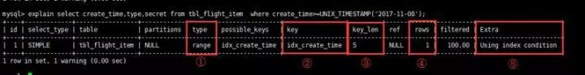

# explain

字段 | 含义
--- | ---
id | 选择标识符
select_type  | 表示查询的类型
table | 输出结果集的表
partitions | 匹配的分区
type | 表示表的连接类型
possible_keys | 表示查询时，可能使用的索引
key | 表示实际使用的索引
key_len | 索引字段的长度
ref | 列与索引的比较
rows | 扫描出的行数(估算的行数)
filtered | 按表条件过滤的行百分比
Extra | 执行情况的描述和说明

## 1. EXPLAIN

做MySQL优化，我们要善用 EXPLAIN 查看SQL执行计划。
下面来个简单的示例，标注(1,2,3,4,5)我们要重点关注的数据

- type列，连接类型。一个好的sql语句至少要达到range级别。杜绝出现all级别
- key列，使用到的索引名。如果没有选择索引，值是NULL。可以采取强制索引方式
- key_len列，索引长度
- rows列，扫描行数。该值是个预估值
- extra列，详细说明。注意常见的不太友好的值有：Using filesort, Using temporary