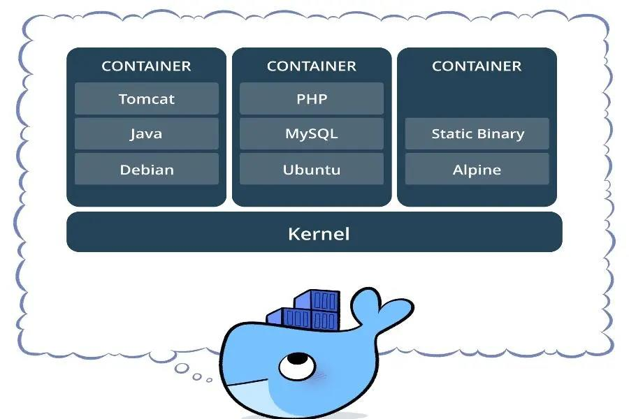

# Docker 的优缺点

<!-- TOC -->

- [Docker 的优缺点](#docker-的优缺点)
    - [Docker解决的问题](#docker解决的问题)
    - [与虚拟机的比较](#与虚拟机的比较)
        - [启动速度](#启动速度)
        - [占用资源](#占用资源)
    - [镜像与容器](#镜像与容器)
    - [优点](#优点)
    - [缺点](#缺点)

<!-- /TOC -->

## Docker解决的问题

由于不同的机器有不同的操作系统，以及不同的库和组件，在将一个应用部署到多台机器上需要进行大量的环境配置操作。

Docker 主要解决环境配置问题，它是一种虚拟化技术，对进程进行隔离，被隔离的进程独立于宿主操作系统和其它隔离的进程。使用 Docker 可以不修改应用程序代码，不需要开发人员学习特定环境下的技术，就能够将现有的应用程序部署在其它机器上。



## 与虚拟机的比较

虚拟机也是一种虚拟化技术，它与 Docker 最大的区别在于它是通过模拟硬件，并在硬件上安装操作系统来实现。


### 启动速度

虚拟机也是一种虚拟化技术，它与 Docker 最大的区别在于它是通过模拟硬件，并在硬件上安装操作系统来实现。

### 占用资源

虚拟机是一个完整的操作系统，需要占用大量的磁盘、内存和 CPU 资源，一台机器只能开启几十个的虚拟机。而 Docker 只是一个进程，只需要将应用以及相关的组件打包，在运行时占用很少的资源，一台机器可以开启成千上万个 Docker。

## 镜像与容器

镜像是一种静态的结构，可以看成面向对象里面的类，而容器是镜像的一个实例。镜像包含着容器运行时所需要的代码以及其它组件，它是一种分层结构，每一层都是只读的（read-only layers）。构建镜像时，会一层一层构建，前一层是后一层的基础。镜像的这种分层存储结构很适合镜像的复用以及定制。构建容器时，通过在镜像的基础上添加一个可写层（writable layer），用来保存着容器运行过程中的修改。


## 优点

**1. 部署方便**
   
你一定还有印象，在我们最开始学习编程的时候，搭建环境这一步往往会耗费我们好几个小时的时间，而且其中一个小问题可能需要找很久才能够解决。你还会得到关于环境搭建方面的团队其他成员的求助。而有了容器之后，这些都变得非常容易，你的开发环境就只是一个或者几个容器镜像的地址，最多再需要一个控制部署流程的执行脚本。或者进一步将你的环境镜像以及镜像脚本放入一个git项目，发布到云端，需要的时候将它拉到本地就可以了。

``` sh
# git clone https://github.com/my-project

# sh ./my-build-boot.sh
```

目前我们团队目前基本都是用这种方案搭建本地开发环境，而且整理成内部技术文档，慢慢沉淀成团队的财富了。

**2. 部署安全**


当我们收到一个bug反馈的时候，很多时候心里面的第一反应一定是“我本地是好的啊”！这种情况的发生就在于环境的不一致，我们在开发过程中的调试往往不能保证其他环境的问题，但是我们却要为此买单，这真是一件令人苦恼的事情。有了容器之后，这将很少发生。我们可以通过容器技术将开发环境和测试环境以及生产环境保持版本和依赖上的统一，保证代码在一个高度统一的环境上执行。而测试环境的统一，也同样能解决CI流程对环境的要求。

分布式技术和扩容需求日益增长的今天，如果运维能够使用容器技术来进行环境的部署，不仅仅在部署时间上节省不少，也能把很多因为人工配置环境产生的失误降到最低。

**3. 隔离性好**


不管是开发还是生产，往往我们一台机器上可能需要跑多个服务，而服务各自需要的依赖配置不尽相同，假如说两个应用需要使用同一个依赖，或者两个应用需要的依赖之间会有一些冲突，这个时候就很容易出现问题了。所以同一台服务器上不同应用提供的不同服务，最好还是将其隔离起来。而容器在这方面有天生的优势，每一个容器就是一个隔离的环境，你对容器内部提供服务的要求，容器可以自依赖的全部提供。这种高内聚的表现可以实现快速的分离有问题的服务，在一些复杂系统中能实现快速排错和及时处理。(当然需要说明的是，这个隔离性只是相对于服务器比较的，虚机技术要拥有更好的隔离性)

**4. 快速回滚**

容器之前的回滚机制，一般需要基于上个版本的应用重新部署，且替换掉目前的问题版本。在最初的时代，可能是一套完整的开发到部署的流程，而执行这一套流程往往需要很长的时间。在基于git的环境中，可能是回退某个历史提交，然后重新部署。这些跟容器技术相比都不够快，而且可能会引起新的问题（因为是基于新版本的修改）。而容器技术天生带有回滚属性，因为每个历史容器或者镜像都会有保存，而替换一个容器或者某个历史镜像是非常快速和简单的。


**5. 成本低**

这可能是一个最明显和有用的优点了，在容器出现之前，我们往往构筑一个应用就需要一台新的服务器或者一台虚机。服务器的购置成本和运维成本都很高，而虚机需要占用很多不必要的资源。相比之下，容器技术就小巧轻便的多，只需要给一个容器内部构建应用需要的依赖就可以了，这也是容器技术发展迅速的最主要原因。

**6. 管理成本更低**

随着容器技术的不断普及和发展，随之而来的容器管理和编排技术也同样得到发展。诸如Docker Swarm，Kubernetes, Mesos等编排工具也在不断的迭代更新，这让容器技术在生产环境中拥有了更多的可能性和更大的发挥空间。而随着大环境的发展，docker等容器的使用和学习的成本也是愈发降低，成为更多开发者和企业的选择。

## 缺点

说了这么多的优点，容器也有一些问题是没有解决的。上一代方案基本就是基于虚机技术的云方案，能有效增加服务器的使用效率，达到节省成本的目的，而容器技术在此基础上更进一步地优化了资源的使用率。但是仍然有一些问题，是我们在选择服务资源架构场景中需要考虑的：

**1. 隔离性**


基于 hypervisor 的虚机技术，在隔离性上比容器技术要更好，它们的系统硬件资源完全是虚拟化的，当一台虚机出现系统级别的问题，往往不会蔓延到同一宿主机上的其他虚机。但是容器就不一样了，容器之间共享同一个操作系统内核以及其他组件，所以在收到攻击之类的情况发生时，更容易通过底层操作系统影响到其他容器。当然，这个问题可以通过在虚机中部署容器来解决，可是这样又会引出新的问题，比如成本的增加以及下面要提到的问题：性能。

**2. 性能**


不管是虚机还是容器，都是运用不同的技术，对应用本身进行了一定程度的封装和隔离，在降低应用和应用之间以及应用和环境之间的耦合性上做了很多努力，但是随机而来的，就会产生更多的网络连接转发以及数据交互，这在低并发系统上表现不会太明显，而且往往不会成为一个应用的瓶颈（可能会分散于不同的虚机或者服务器上），但是当同一虚机或者服务器下面的容器需要更高并发量支撑的时候，也就是并发问题成为应用瓶颈的时候，容器会将这个问题放大，所以，并不是所有的应用场景都是适用于容器技术的。

**3. 存储方案**


容器的诞生并不是为OS抽象服务的，这是它和虚机最大的区别，这样的基因意味着容器天生是为应用环境做更多的努力，容器的伸缩也是基于容器的这一disposable特性，而与之相对的，需要持久化存储方案恰恰相反。这一点docker容器提供的解决方案是利用volume接口形成数据的映射和转移，以实现数据持久化的目的。但是这样同样也会造成一部分资源的浪费和更多交互的发生，不管是映射到宿主机上还是到网络磁盘，都是退而求其次的解决方案。

随着硬件技术和网络技术的迭代发展，容器技术的缺点会变得越来越不那么明显，而且随着容器技术的发展和普及，对应的解决方案也会越来越多。所以总体来看，docker等容器技术会朝着更加普及的趋势走近我们技术领域。也希望每一位热爱技术的小伙伴们能更加了解这些新技术，让它们能够更好的为我们服务。