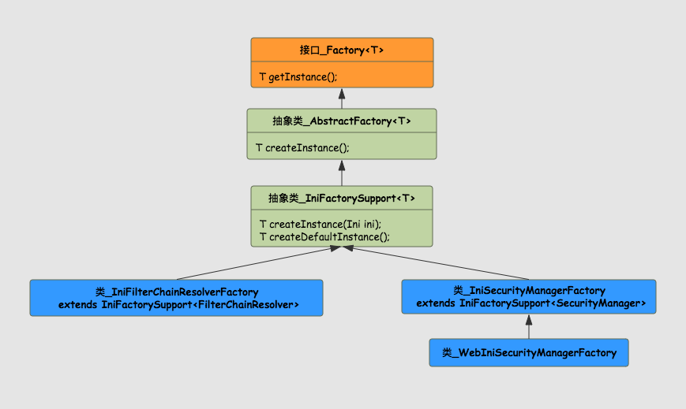

# Factory<T>

<!-- TOC -->

- [Factory<T>](#factoryt)
    - [AbstractFactory<T>](#abstractfactoryt)
    - [IniFactorySupport<T>](#inifactorysupportt)
    - [IniSecurityManagerFactory](#inisecuritymanagerfactory)

<!-- /TOC -->

Generics-aware interface supporting the Factory Method design pattern.

支持工厂方法设计模式的泛型感知接口。



## AbstractFactory<T>

工厂接口的一个抽象类，实现了` T getInstance() `方法，内部维护着一个实例对象，并可以设置单例或者多例，默认是单例。将创建对象的任务委托给子类，由子类实现`T createInstance()`方法。
```java
private boolean singleton;
private T singletonInstance;
protected abstract T createInstance();
```

## IniFactorySupport<T>

Base support class for Factory implementations that generate their instance(s) based on Ini configuration.

该实现类 支持生成基于 Ini configuration 配置的实例。

该类实现了父类的`T createInstance()`方法，并通过传入`Ini`对象，让子类去根据具体的泛型去实现相应的实例。
```
protected abstract T createInstance(Ini ini);

protected abstract T createDefaultInstance();
```

## IniSecurityManagerFactory

> A {@link Factory} that creates {@link SecurityManager} instances based on {@link Ini} configuration.

> 一个基于Ini配置创建SecurityManager实例的工厂。
- `extends IniFactorySupport<SecurityManager>`

```java
public class IniSecurityManagerFactory extends IniFactorySupport<SecurityManager> {

    private SecurityManager createSecurityManager(Ini ini) {
        Ini.Section mainSection = ini.getSection(MAIN_SECTION_NAME);
        if (CollectionUtils.isEmpty(mainSection)) {
            //try the default:
            mainSection = ini.getSection(Ini.DEFAULT_SECTION_NAME);
        }
        return createSecurityManager(ini, mainSection);
    }
    
    @SuppressWarnings({"unchecked"})
    private SecurityManager createSecurityManager(Ini ini, Ini.Section mainSection) {

        Map<String, ?> defaults = createDefaults(ini, mainSection);
        Map<String, ?> objects = buildInstances(mainSection, defaults);

        SecurityManager securityManager = getSecurityManagerBean();

        boolean autoApplyRealms = isAutoApplyRealms(securityManager);

        if (autoApplyRealms) {
            //realms and realm factory might have been created - pull them out first so we can
            //initialize the securityManager:
            Collection<Realm> realms = getRealms(objects);
            //set them on the SecurityManager
            if (!CollectionUtils.isEmpty(realms)) {
                applyRealmsToSecurityManager(realms, securityManager);
            }
        }

        return securityManager;
    }
    
    
}

```
该类中创建`SecurityManager`的主要方法是`createSecurityManager(Ini ini)`，主要步骤有以下几步：
1. `createDefaults(ini, mainSection)`创建一个默认的map，此map中有`DefaultSecurityManager`和`IniRealm`实例;
2. `buildInstances(mainSection, defaults)`将上一步产生的map进行初始化，凡是实现了`Initializable`接口的类都进行初始化一遍。
3. 进行`setRealm`操作。
