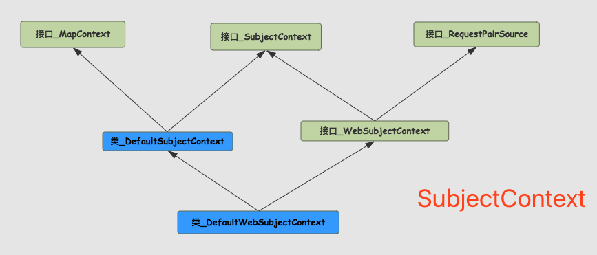
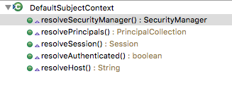

# SubjectContext

<!-- TOC -->

- [SubjectContext](#subjectcontext)
    - [<类>MapContext - 存储所有的Context（上下文）](#类mapcontext---存储所有的context上下文)
    - [resolve* ,开头的方法](#resolve-开头的方法)

<!-- /TOC -->

## <类>MapContext - 存储所有的Context（上下文）

这个对象中仅包括一个私有的`Map<String,Object>` **backingMap** 对象，还包含一些操作该对象的方法。所以说这个对象主要是用于给子类提供数据存储并且操作的。这要的key-value如下所示。

 key - （ **`DefaultSubjectContext.class.getName()`** +后缀） | value - （类型）
 ---: |---
   ".SECURITY_MANAGER"; | SecurityManager.class
   ".SESSION_ID"; | Serializable.class
   ".AUTHENTICATION_TOKEN"; | AuthenticationToken.class
   ".AUTHENTICATION_INFO"; | AuthenticationInfo.class
   ".SUBJECT"; | Subject.class
   ".PRINCIPALS"; | PrincipalCollection.class
   ".SESSION"; | Session.class
   ".AUTHENTICATED"; | Boolean.class
   ".HOST"; | String.class
   ".SESSION_CREATION_ENABLED"; | Boolean.class
  
  backingMap 中的 **Session**对象所包含的属性`session.getAttribute(key)`
 
 描述 | key - （ ++`DefaultSubjectContext.class.getName()`++ +后缀） | value - （类型）
 ---|---:|---
 存储 subject 的 principals. |   "_PRINCIPALS_SESSION_KEY"; | PrincipalCollection.class
 存储用户是否经过身份验证。 |   "_AUTHENTICATED_SESSION_KEY"; | Boolean.class

## resolve* ,开头的方法

描述  | DefaultWebSubjectFactory
---|---
 解析RecurityManager  | resolveSecurityManager()
 解析Principals | resolvePrincipals
 解析session | resolveSession
 解析resolveAuthenticated | resolveAuthenticated
 解析Host（主要也是判断是否为空）  | resolveHost

 描述  | DefaultSubjectFactory
 ---|---
 重写  |  resolveHost
 判断是否为空  | resolveServletRequest
 判断是否为空  | resolveServletResponse
