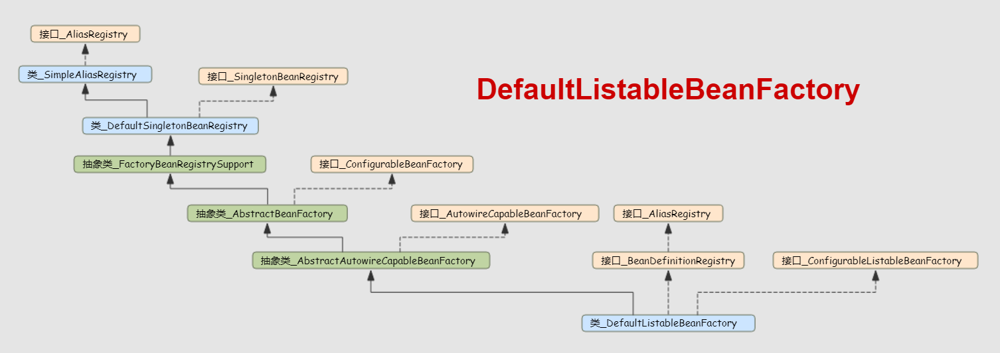

# DefaultListableBeanFactory

<!-- TOC -->

- [DefaultListableBeanFactory](#defaultlistablebeanfactory)
  - [内置对象](#内置对象)
  - [dependentBeanMap](#dependentbeanmap)

<!-- /TOC -->

上图为**DefaultListableBeanFactory**的继承关系

## 内置对象

DefaultListableBeanFactory

修饰符 | 类型  | 字段名
---|---| --
| `static` |  `Class<?>` | javaxInjectProviderClass
|  | `String` | serializationId
|  | `boolean` | allowBeanDefinitionOverriding
|  | `boolean` | allowEagerClassLoading
|  | `Comparator<Object>` | dependencyComparator
|  | `AutowireCandidateResolver` | autowireCandidateResolver
| `final` |  `Map<Class<?>, Object>` | resolvableDependencies
| `final` |  `Map<String, BeanDefinition>` | beanDefinitionMap
| `final` |  `Map<Class<?>, String[]>` | allBeanNamesByType
| `final` |  `Map<Class<?>, String[]>` | singletonBeanNamesByType
| `volatile` |  `List<String>` | beanDefinitionNames
| `volatile` |  `Set<String>` | manualSingletonNames
| `volatile` |  `String[]` | frozenBeanDefinitionNames
| `volatile` |  `boolean` | configurationFrozen

AbstractAutowireCapableBeanFactory

修饰符 | 类型  | 字段名
---|---| ---
| | `InstantiationStrategy` |  instantiationStrategy
| | `ParameterNameDiscoverer` |  parameterNameDiscoverer
| | `boolean` |  allowCircularReferences
| | `boolean` |  allowRawInjectionDespiteWrapping
| `final` |  `Set<Class<?>>` |  ignoredDependencyTypes
| `final` |  `Set<Class<?>>` |  ignoredDependencyInterfaces
| `final` |  `NamedThreadLocal<String>` |  currentlyCreatedBean
| `final` |  `Map<String, BeanWrapper>` |  factoryBeanInstanceCache
| `final` |  `ConcurrentMap<Class<?>, PropertyDescriptor[]>`  | filteredPropertyDescriptorsCache

AbstractBeanFactory

修饰符 |类型 | 字段名  |
---|---|---|
|  | `BeanFactory` |  parentBeanFactory
|  | `ClassLoader` |  beanClassLoader
|  | `ClassLoader` |  tempClassLoader
|  | `boolean` |  cacheBeanMetadata
|  | `BeanExpressionResolver` |  beanExpressionResolver
|  | `ConversionService` |  conversionService
| `final` |  `Set<PropertyEditorRegistrar>` |  propertyEditorRegistrars
| `final` |  `Map<Class<?>, Class<? extends PropertyEditor>>` |  customEditors
|  | `TypeConverter` |  typeConverter
| `final` |  `List<StringValueResolver>` |  embeddedValueResolvers
| `final` |  `List<BeanPostProcessor>` |  beanPostProcessors
|  | `boolean` |  hasInstantiationAwareBeanPostProcessors
|  | `boolean` |  hasDestructionAwareBeanPostProcessors
| `final` |  `Map<String, Scope>` |  scopes
|  | `SecurityContextProvider` |  securityContextProvider
| `final` |  `Map<String, RootBeanDefinition>` |  mergedBeanDefinitions
| `final` |  `Set<String>` |  alreadyCreated
| `final` |  `ThreadLocal<Object>` |  prototypesCurrentlyInCreation

| FactoryBeanRegistrySupport  |
|---|
| `Map<String, Object>` factoryBeanObjectCache

DefaultSingletonBeanRegistry
修饰符 |类型 | 字段名  |
---|---|---|
| `final` | `Map<String, Object>` |  singletonObjects
| `final` | `Map<String, ObjectFactory<?>>` |  singletonFactories
| `final` | `Map<String, Object>` |  earlySingletonObjects
| `final` | `Set<String>` |  registeredSingletons
| `final` | `Set<String>` |  singletonsCurrentlyInCreation
| `final` | `Set<String>` |  inCreationCheckExclusions
|  | `Set<Exception>` |  suppressedExceptions
|  | `boolean` |  singletonsCurrentlyInDestruction
| `final` | `Map<String, Object>` |  disposableBeans
| `final` | `Map<String, Set<String>>` |  containedBeanMap
| `final` | `Map<String, Set<String>>` |  dependentBeanMap
| `final` | `Map<String, Set<String>>` |  dependenciesForBeanMap

SimpleAliasRegistry
修饰符 |类型 | 字段名  |
---|---|---|
| `final` |  `Map<String, String>` | aliasMap

## dependentBeanMap

- org.springframework.context.annotation.internalConfigurationAnnotationProcessor
- org.springframework.context.annotation.ConfigurationClassPostProcessor