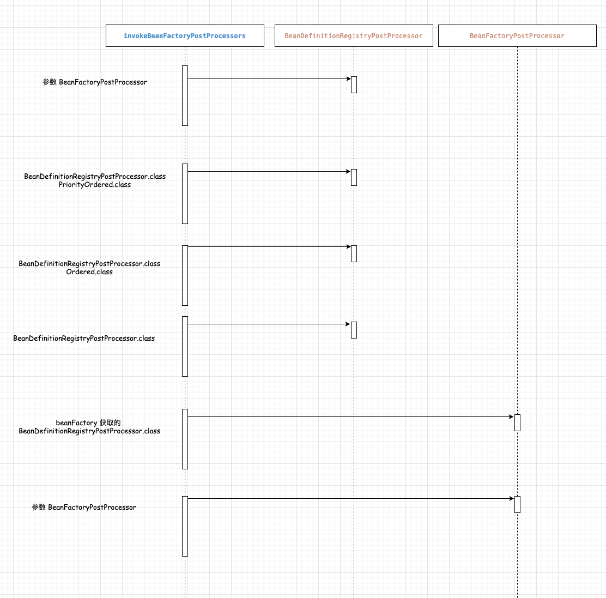

# invokeBeanFactoryPostProcessors方法

<!-- TOC -->

- [invokeBeanFactoryPostProcessors方法](#invokebeanfactorypostprocessors方法)
  - [第一阶段](#第一阶段)
  - [First](#first)
  - [Next](#next)
  - [Finally](#finally)
  - [end](#end)
  - [4步操作](#4步操作)
  - [第二阶段](#第二阶段)
  - [First](#first-1)
  - [Next](#next-1)
  - [Finally](#finally-1)
  - [end](#end-1)
  - [顺序](#顺序)
  - [总结](#总结)
    - [第一阶段](#第一阶段-1)
    - [第二阶段](#第二阶段-1)

<!-- /TOC -->





## 第一阶段

| 参数  |
|---|
| `ConfigurableListableBeanFactory` beanFactory  |
| `List<BeanFactoryPostProcessor>` beanFactoryPostProcessors  |


``` java
Set<String> processedBeans = new HashSet<>();
List<BeanFactoryPostProcessor> regularPostProcessors = new LinkedList<>();
List<BeanDefinitionRegistryPostProcessor> registryProcessors = new LinkedList<>();
List<BeanDefinitionRegistryPostProcessor> currentRegistryProcessors = new ArrayList<>();
```

变量类型| 变量名  | 翻译  |
---|---|---|
`Set<String>`  | processedBeans  | processedBeans  | 
`List<BeanFactoryPostProcessor>` | regularPostProcessors  |  常规的post processors |
`List<BeanDefinitionRegistryPostProcessor>` | registryProcessors  | registry(注册中心) processors  |
`List<BeanDefinitionRegistryPostProcessor>` | currentRegistryProcessors  | 当前的 registry processors  |
`String[]`  | postProcessorNames  | post processor 名称  | 


首先将参数`beanFactoryPostProcessors`根据类型`BeanDefinitionRegistryPostProcessor`筛选，将结果分别放到`regularPostProcessors`和`registryProcessors`变量中，并将`registryProcessors`变量中的成员进行如下操作：
``` java
registryProcessor.postProcessBeanDefinitionRegistry(registry);
```

## First

> 调用实现`PriorityOrdered`的`BeanDefinitionRegistryPostProcessor`

从`beanFactory`中获取类型为`BeanDefinitionRegistryPostProcessor.class`的bean名称数组赋值给`postProcessorNames`，

如果bean同时所属`PriorityOrdered.class`类型则添加到`currentRegistryProcessors`和`processedBeans`(bean的name)中。

- 接下来 >>> [4步操作](#4%E6%AD%A5%E6%93%8D%E4%BD%9C)
  
## Next

> 调用实现`Ordered`的`BeanDefinitionRegistryPostProcessor`

从`beanFactory`中获取类型为`BeanDefinitionRegistryPostProcessor.class`的bean名称数组赋值给`postProcessorNames`，

如果bean同时所属`Ordered.class`类型**并且`processedBeans`变量中不包含此bean**则添加到`currentRegistryProcessors`和`processedBeans`(bean的name)

- 接下来 >>> [4步操作](#4%E6%AD%A5%E6%93%8D%E4%BD%9C)
  
## Finally

> 调用所有其他的`BeanDefinitionRegistryPostProcessor`，直到不再出现`BeanDefinitionRegistryPostProcessors`。

从`beanFactory`中获取类型为`BeanDefinitionRegistryPostProcessor.class`的bean名称数组赋值给`postProcessorNames`，

**如果bean同时满足`processedBeans`变量中不包含此bean** 则添加到`currentRegistryProcessors`和`processedBeans`(bean的name)，循环执行直到`beanFactory`不再出现`BeanDefinitionRegistryPostProcessors`为止。

- 接下来 >>> [4步操作](#4%E6%AD%A5%E6%93%8D%E4%BD%9C)


## end
现在，调用到目前为止处理的所有处理器的postProcessBeanFactory回调。
``` java
    // Now, invoke the postProcessBeanFactory callback of all processors handled so far.
    invokeBeanFactoryPostProcessors(registryProcessors, beanFactory);
    invokeBeanFactoryPostProcessors(regularPostProcessors, beanFactory);
```

## 4步操作

1. 对`currentRegistryProcessors`排序
2. 将`currentRegistryProcessors`添加到`registryProcessors`中
3. 循环调用`currentRegistryProcessors`的成员
4. 清空`currentRegistryProcessors`

代码如下所示：
``` java
sortPostProcessors(currentRegistryProcessors, beanFactory);
registryProcessors.addAll(currentRegistryProcessors);
invokeBeanDefinitionRegistryPostProcessors(currentRegistryProcessors, registry);
currentRegistryProcessors.clear();
```
## 第二阶段


变量类型| 变量名  | 翻译  |
---|---|---|
`String[]`  | postProcessorNames  | processedBeans  | 
`List<BeanFactoryPostProcessor>` | priorityOrderedPostProcessors  |  优先排序 post processors |
`List<String>` | orderedPostProcessorNames  |  有序的post processors |
`List<String>` | nonOrderedPostProcessorNames  |  常规的post processors |

> // Do not initialize FactoryBeans here: We need to leave all regular beans  
// uninitialized to let the bean factory post-processors apply to them!  
> 不要在这里初始化FactoryBeans：我们需要保留所有常规bean  
> 未初始化让bean工厂的后处理器适用于他们！

从`beanFactory`中获取类型为`BeanFactoryPostProcessor.class`的bean名称数组赋值给`postProcessorNames`，循环`postProcessorNames`数组：

1. 如果`processedBeans`变量中不包含此bean名称,则跳过 - 已在上面的第一阶段处理过
2. 调用`beanFactory.isTypeMatch()`方法判断bean的名称与`PriorityOrdered.class`是否匹配，若匹配则将获取bean并将其添加到`priorityOrderedPostProcessors`集合中。
3. 调用`beanFactory.isTypeMatch()`方法判断bean的名称与`Ordered.class`是否匹配，若匹配则将bean的名称添加到`orderedPostProcessorNames`集合中。
4. 都不匹配的添加到`nonOrderedPostProcessorNames`集合中。

## First

两步走。

1. 排序`priorityOrderedPostProcessors`，
1. 以`priorityOrderedPostProcessors`为参数调用`invokeBeanFactoryPostProcessors()`方法
``` java
// First, invoke the BeanFactoryPostProcessors that implement PriorityOrdered.
sortPostProcessors(priorityOrderedPostProcessors, beanFactory);
invokeBeanFactoryPostProcessors(priorityOrderedPostProcessors, beanFactory);
```

## Next

``` java
List<BeanFactoryPostProcessor> orderedPostProcessors = new ArrayList<>();
```

循环`orderedPostProcessorNames`集合通过beanFactory中获取bean添加到`orderedPostProcessors`集合中，然后两步走。

1. 排序`orderedPostProcessors`，调用`sortPostProcessors()`。
1. 以`orderedPostProcessors`为参数调用`invokeBeanFactoryPostProcessors()`。

## Finally

``` java
List<BeanFactoryPostProcessor> nonOrderedPostProcessors = new ArrayList<>();
```
循环`nonOrderedPostProcessorNames`集合通过beanFactory中获取bean添加到`nonOrderedPostProcessors`集合中，然后两步走。


1. 排序`orderedPostProcessors`，调用`sortPostProcessors()`。
1. 以`orderedPostProcessors`为参数调用`invokeBeanFactoryPostProcessors()`。

## end
清除缓存后的合并bean定义，因为post-processors 可能有修改了原始元数据，例如 替换值中的占位符...
``` java
// Clear cached merged bean definitions since the post-processors might have
// modified the original metadata, e.g. replacing placeholders in values...
beanFactory.clearMetadataCache();
```


## 顺序

- ConfigurationClassPostProcessor
- DefaultEventListenerFactory
- EventListenerMethodProcessor
- AutowiredAnnotationBeanPostProcessor
- CommonAnnotationBeanPostProcessor
- RequiredAnnotationBeanPostProcessor


## 总结


### 第一阶段


首先主要处理`BeanDefinitionRegistryPostProcessor.class`接口类型，并每一步都调用了该接口下的唯一方法 `postProcessBeanDefinitionRegistry()`。

`BeanDefinitionRegistryPostProcessor.class`类型的对象，从参数里获取，然后执行方法 `postProcessBeanDefinitionRegistry()`。

`BeanDefinitionRegistryPostProcessor.class`类型的对象，从BeanFactory获取。

其次由于`BeanDefinitionRegistryPostProcessor.class`是`BeanFactoryPostProcessor.class`的子接口，所以会在 end步 循环调用`BeanFactoryPostProcessor.class`下的唯一方法，结束。而对于`BeanFactoryPostProcessor.class`的处理顺序是优先处理属于`BeanDefinitionRegistryPostProcessor.class`，其次再处理参数。


### 第二阶段

主要处理`BeanFactoryPostProcessor.class`，并且都是从BeanFactory获取到的，处理的顺序由以下顺序决定

1. PriorityOrdered.class
1. Ordered.class
1. 不属于前两者


###

1

- key: `org.springframework.context.annotation.internalConfigurationAnnotationProcessor`
- value: `org.springframework.context.annotation.ConfigurationClassPostProcessor`

2

- key: `org.springframework.context.event.internalEventListenerFactory`
- value: `org.springframework.context.event.DefaultEventListenerFactory`

3

- key: `org.springframework.context.event.internalEventListenerProcessor`
- value: `org.springframework.context.event.EventListenerMethodProcessor`

4

- key: `org.springframework.context.annotation.internalAutowiredAnnotationProcessor`
- value: `org.springframework.beans.factory.annotation.AutowiredAnnotationBeanPostProcessor`

5

- key: `org.springframework.context.annotation.internalCommonAnnotationProcessor`
- value: `org.springframework.context.annotation.CommonAnnotationBeanPostProcessor`

6

- key: `demoApplication`
- value: `com.shigeqiu.demo.DemoApplication`