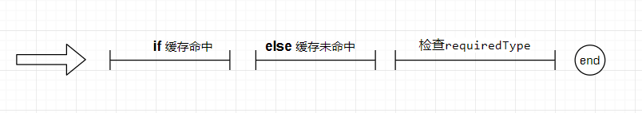

# doGetBean

Return an instance, which may be shared or independent, of the specified bean.

返回指定 bean 的实例，该实例可以是共享的，也可以是独立的。


<!-- TOC -->

- [doGetBean](#dogetbean)
    - [位置](#位置)
    - [参数返回值](#参数返回值)
    - [方法体](#方法体)
        - [缓存命中](#缓存命中)
        - [缓存未命中](#缓存未命中)
        - [检查requiredType](#检查requiredtype)

<!-- /TOC -->

## 位置

``` java
public abstract class AbstractBeanFactory extends FactoryBeanRegistrySupport implements ConfigurableBeanFactory {
    protected <T> T doGetBean(final String name, @Nullable final Class<T> requiredType,
			@Nullable final Object[] args, boolean typeCheckOnly) throws BeansException {
    }

}
```


## 参数返回值

**name** : the name of the bean to retrieve , 要检索的bean的名称 .

**requiredType** : 
the required type of the bean to retrieve , 要检索的bean的必需类型 .

**args** : arguments to use when creating a bean instance using explicit arguments (only applied when creating a new instance as opposed to retrieving an existing one) , 使用显式参数创建bean实例时使用的参数（仅适用于创建新实例而不是检索现有实例） .

**typeCheckOnly** : whether the instance is obtained for a type check, not for actual use , 是否为类型检查而不是实际使用而获取实例 .

**return** : an instance of the bean , 返回一个bean实例 . 

**异常BeansException** : if the bean could not be created , 如果无法创建bean则跑出该异常 .

## 方法体



解析beanName , 如果存在工厂引用前缀则去掉，并将别名解析为规范名称。


### 缓存命中

``` java
// Eagerly check singleton cache for manually registered singletons.
Object sharedInstance = getSingleton(beanName);
if (sharedInstance != null && args == null) {
  if (logger.isTraceEnabled()) {
    if (isSingletonCurrentlyInCreation(beanName)) {
      logger.trace("Returning eagerly cached instance of singleton bean '" + beanName +
          "' that is not fully initialized yet - a consequence of a circular reference");
    }
    else {
      logger.trace("Returning cached instance of singleton bean '" + beanName + "'");
    }
  }
  bean = getObjectForBeanInstance(sharedInstance, name, beanName, null);
}
```
Eagerly check singleton cache for manually registered singletons. 提前去检查缓存中是否存在单例bean，如果没有则去注册单例bean，并且返回bean实例。检查的缓存集合如下所示：

| DefaultSingletonBeanRegistry(类名)  | 字段名 | 
|---|---|
| `final Map<String, Object>` |  singletonObjects
| `final Map<String, ObjectFactory<?>>` | singletonFactories
| `final Map<String, Object>` |  earlySingletonObjects

### 缓存未命中

``` java
if (isPrototypeCurrentlyInCreation(beanName)) {
  throw new BeanCurrentlyInCreationException(beanName);
}
```

Return whether the specified prototype bean is currently in creation (within the current thread).  
返回指定的原型bean是否正在创建中(在当前线程中)。如果正在创建则抛出异常。

```java
// Check if bean definition exists in this factory.
BeanFactory parentBeanFactory = getParentBeanFactory();
if (parentBeanFactory != null && !containsBeanDefinition(beanName)) {
  // Not found -> check parent.
  String nameToLookup = originalBeanName(name);
  if (parentBeanFactory instanceof AbstractBeanFactory) {
    return ((AbstractBeanFactory) parentBeanFactory).doGetBean(
        nameToLookup, requiredType, args, typeCheckOnly);
  }
  else if (args != null) {
    // Delegation to parent with explicit args.
    return (T) parentBeanFactory.getBean(nameToLookup, args);
  }
  else if (requiredType != null) {
    // No args -> delegate to standard getBean method.
    return parentBeanFactory.getBean(nameToLookup, requiredType);
  }
  else {
    return (T) parentBeanFactory.getBean(nameToLookup);
  }
}
```

Check if bean definition exists in this factory.   
检查在parent factory 中是否存在该bean的定义，如果存在则从parent facotry 中获取。

``` java
if (!typeCheckOnly) {
  markBeanAsCreated(beanName);
}
```

Mark the specified bean as already created (or about to be created).
This allows the bean factory to optimize its caching for repeated creation of the specified bean.   
根据 `typeCheckOnly` 判断，将指定的bean标记为已创建（或即将创建）。
这允许bean工厂优化其缓存以重复创建指定的bean。

涉及到的集合如下所示：

类 | 类型  | 字段名 | 
---|---| --- | 
AbstractBeanFactory | `final Map<String, RootBeanDefinition>` | mergedBeanDefinitions
AbstractBeanFactory | `final Set<String>` | alreadyCreated


``` java
final RootBeanDefinition mbd = getMergedLocalBeanDefinition(beanName);
checkMergedBeanDefinition(mbd, beanName, args);
```

获取`RootBeanDefinition mbd`变量，Return a merged RootBeanDefinition, traversing the parent bean definition if the specified bean corresponds to a child bean definition.  
返回合并的 RootBeanDefinition ，如果指定的bean对应于子bean定义，则遍历父bean定义。相关的集合如下：

类 | AbstractBeanFactory  | 字段名 | 
---|---| --- | 
AbstractBeanFactory | `Map<String, RootBeanDefinition>` | mergedBeanDefinitions
DefaultListableBeanFactory | `Map<String, BeanDefinition>` | beanDefinitionMap

Check the given merged bean definition, potentially throwing validation exceptions.  
检查给定的合并bean定义，可能引发验证异常。

``` java
// Guarantee initialization of beans that the current bean depends on.
String[] dependsOn = mbd.getDependsOn();
if (dependsOn != null) {
  for (String dep : dependsOn) {
    if (isDependent(beanName, dep)) {
      throw new BeanCreationException(mbd.getResourceDescription(), beanName,
          "Circular depends-on relationship between '" + beanName + "' and '" + dep + "'");
    }
    registerDependentBean(dep, beanName);
    try {
      getBean(dep);
    }
    catch (NoSuchBeanDefinitionException ex) {
      throw new BeanCreationException(mbd.getResourceDescription(), beanName,
          "'" + beanName + "' depends on missing bean '" + dep + "'", ex);
    }
  }
}
```

Guarantee initialization of beans that the current bean depends on.保证当前bean依赖的bean初始化。

Create bean instance. 创建bean实例

### 检查requiredType

Check if required type matches the type of the actual bean instance. 检查 **所需类型 (requiredType)** 是否与实际bean实例的类型匹配。
