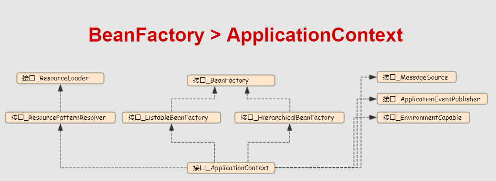
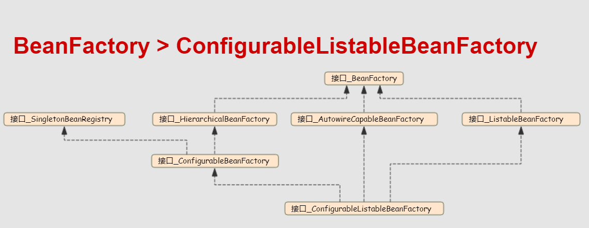

# BeanFactory两大顶级接口分支

<!-- TOC -->

- [BeanFactory两大顶级接口分支](#beanfactory两大顶级接口分支)
    - [两大顶级接口分支UML图](#两大顶级接口分支uml图)
    - [BeanFactory](#beanfactory)
    - [HierarchicalBeanFactory](#hierarchicalbeanfactory)
    - [ListableBeanFactory](#listablebeanfactory)
    - [AutowireCapableBeanFactory](#autowirecapablebeanfactory)

<!-- /TOC -->

## 两大顶级接口分支UML图

上图为**BeanFactory**到**ApplicationContext**的继承关系

上图为**BeanFactory**到**ConfigurableListableBeanFactory**的继承关系

| 接口名  | 释义  |
|---|---|
| HierarchicalBeanFactory  | 分层的Bean Factory  |
| ListableBeanFactory  | 可(列表式)浏览的Bean Factory  |
| AutowireCapableBeanFactory  | 有自动装配能力的Bean Factory  |

## BeanFactory

访问Spring bean容器的根接口

| 返回值  | 方法名&参数  |
|---|---|
| `Object` | getBean(`String` name) |
| `<T>` **`T`** | getBean(`String` name, `@Nullable` `Class<T>` requiredType) |
| `Object` | getBean(`String` name, `Object...` args) |
| `<T>` **`T`** | getBean(`Class<T>` requiredType) |
| `<T>` **`T`** | getBean(`Class<T>` requiredType, Object... args) |
| `boolean` | containsBean(`String` name) |
| `boolean` | isSingleton(`String` name) |
| `boolean` | isPrototype(`String` name) |
| `boolean` | isTypeMatch(`String` name, `ResolvableType` typeToMatch) |
| `boolean` | isTypeMatch(`String` name, `@Nullable` `Class<?>` typeToMatch) |
| `Class<?>` | getType(`String` name) |
| `String[]` | getAliases(`String` name) |

## HierarchicalBeanFactory

| 返回值  | 方法名&参数  |
|---|---|
| `BeanFactory` | getParentBeanFactory() |
| `boolean` | containsLocalBean(`String` name) |

## ListableBeanFactory

| 返回值  | 方法名&参数  |
|---|---|
| `boolean` | containsBeanDefinition(`String` beanName) |
| `int` | getBeanDefinitionCount() |
| `String[]` | getBeanDefinitionNames() |
| `String[]` | getBeanNamesForType(`ResolvableType` type) |
| `String[]` | getBeanNamesForType(`@Nullable` `Class<?>` type) |
| `String[]` | getBeanNamesForType`@Nullable` `Class<?>` type, `boolean` includeNonSingletons, `boolean` allowEagerInit) |
| `<T>` **`Map<String, T>`** | getBeansOfType(`@Nullable Class<T>` type) |
| `<T>` **`Map<String, T>`** | getBeansOfType(`@Nullable Class<T>` type, `boolean` includeNonSingletons, `boolean` allowEagerInit) |
| `String[]` | getBeanNamesForAnnotation(`Class<? extends Annotation>` annotationType) |
| `Map<String, Object>` | getBeansWithAnnotation(`Class<? extends Annotation>` annotationType) |
| `<A extends Annotation>` **`A`** | findAnnotationOnBean(`String` beanName, `Class<A>` annotationType) |

## AutowireCapableBeanFactory

| 返回值  | 方法名&参数  |
|---|---|
| `<T>` **`T`** | createBean(`Class<T>` beanClass) |
| `void` | autowireBean(`Object` existingBean) |
| `Object` | configureBean(`Object` existingBean, `String` beanName) |
| `Object` | createBean(`Class<?>` beanClass, `int` autowireMode, `boolean` dependencyCheck) |
| `Object` | autowire(`Class<?>` beanClass, `int` autowireMode, `boolean` dependencyCheck) |
| `void` | autowireBeanProperties(`Object` existingBean, `int` autowireMode, `boolean` dependencyCheck) |
| `void` | applyBeanPropertyValues(`Object` existingBean, `String` beanName) |
| `Object` | initializeBean(`Object` existingBean, `String` beanName) |
| `Object` | applyBeanPostProcessorsBeforeInitialization(`Object` existingBean, `String` beanName) |
| `Object` | applyBeanPostProcessorsAfterInitialization(`Object` existingBean, `String` beanName) |
| `void` | destroyBean(`Object` existingBean) |
| `<T>` **`NamedBeanHolder<T>`** | resolveNamedBean(`Class<T>` requiredType) |
| `Object` | resolveDependency(`DependencyDescriptor` descriptor, `@Nullable` `String` requestingBeanName) |
| `Object` | resolveDependency(`DependencyDescriptor` descriptor, `@Nullable` `String` requestingBeanName, `@Nullable` `Set<String>` autowiredBeanNames, `@Nullable` `TypeConverter` typeConverter) |