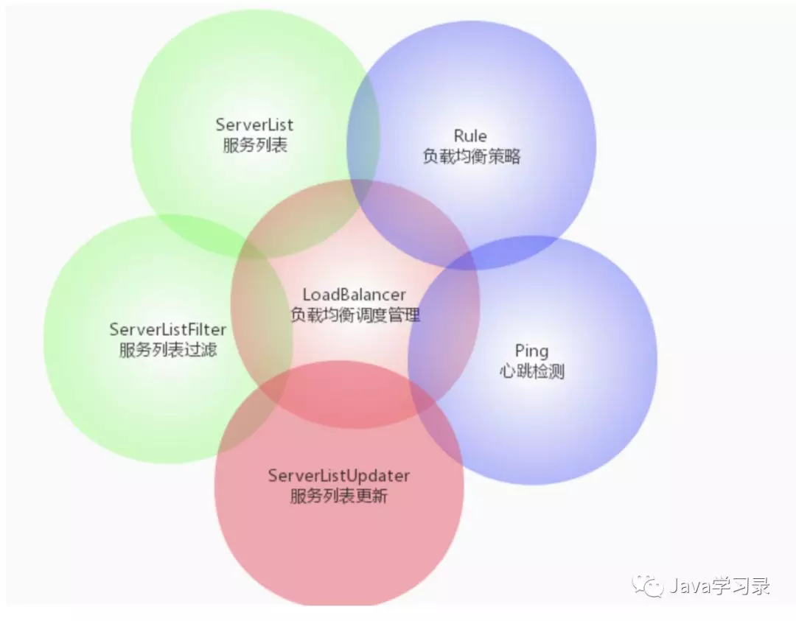
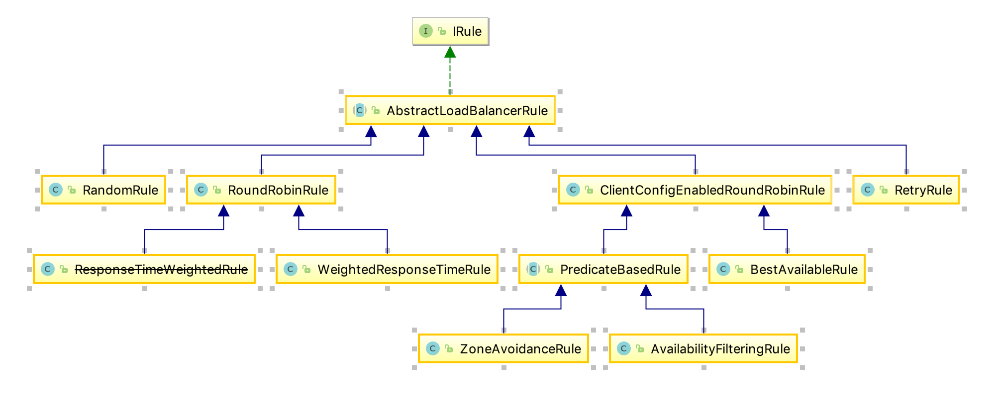

# Spring Cloud Ribbon

<!-- TOC -->

- [Spring Cloud Ribbon](#spring-cloud-ribbon)
  - [组成](#%e7%bb%84%e6%88%90)
  - [配置](#%e9%85%8d%e7%bd%ae)
    - [代码方式](#%e4%bb%a3%e7%a0%81%e6%96%b9%e5%bc%8f)
    - [配置文件方式](#%e9%85%8d%e7%bd%ae%e6%96%87%e4%bb%b6%e6%96%b9%e5%bc%8f)
  - [Ribbon饥饿加载](#ribbon%e9%a5%a5%e9%a5%bf%e5%8a%a0%e8%bd%bd)
  - [负载均衡策略](#%e8%b4%9f%e8%bd%bd%e5%9d%87%e8%a1%a1%e7%ad%96%e7%95%a5)
  - [超时重试机制](#%e8%b6%85%e6%97%b6%e9%87%8d%e8%af%95%e6%9c%ba%e5%88%b6)

<!-- /TOC -->

Spring Cloud Ribbon 是一个客户端的负载均衡器。客户端会向 Eureka Server 读取注册到服务器的可用服务信息列表，然后根据设定的负载均衡策略（没有设置即用默认的），抉择出向哪台服务器发送请求。


## 组成



> https://cloud.spring.io/spring-cloud-static/spring-cloud-netflix/2.2.2.RELEASE/reference/html/#spring-cloud-ribbon

| 接口  | 作用  | 默认值
|---|---|---|
| `IClientConfig` | 	读取配置 |	DefaultClientConfigImpl
| `IRule` |	负载均衡规则，选择实例 |	ZoneAvoidanceRule
| `IPing` |	筛选掉ping不通的实例 |	DumyPing（该类什么不干，认为每个实例都可用，都能ping通）
| `ServerList<Server>` |	交给Ribbon的实例列表 |	**Ribbon**:ConfigurationBasedServerList ， **Spring Cloud Alibaba**:NacosServerList
| `ServerListFilter<Server>` |	过滤掉不符合条件的实例 |	ZonePreferenceServerListFilter
| `ILoadBalancer` |	Ribbon的入口 |	ZoneAwareLoadBalancer
| `ServerListUpdater` |	更新交给Ribbon的List的策略 |	PollingServerListUpdater

- `IClientConfig` Ribbon支持非常灵活的配置就是由该组件提供的。
- `IRule `为Ribbon提供规则，从而选择实例、该组件是最核心的组件

## 配置

Spring Cloud Ribbon 支持多种配置方式，最常用的是以 application.yml 等配置文件和编程式的方式进行配置。我们先来熟悉一下配置的格式。`<clientName>.<nameSpace>.<propertyName>=<value>` 的格式来描述参数的，其中 `clientName` 代表了基于 Ribbon 客户端的名称，而 `nameSpace` 则是类似配置组的概念，代表了一组配置的参数。

### 代码方式

**全局配置如下：**

``` java
@Configuration
@RibbonClients(defaultConfiguration = GoodsRibbonRuleConfig.class)
//Ribbon负载均衡全局粒度配置（所有服务都按照这个配置）
public class RibbonConfig {
}
```

**指定服务配置如下：**

``` java
@Configuration
@RibbonClient(name = "${服务名称}", configuration = GoodsRibbonRuleConfig.class)
//configuration: 指向负载均衡规则的配置类
public class GoodsRibbonConfig {
}
```

``` java
@Configuration
public class GoodsRibbonRuleConfig {
    @Bean
    public IRule ribbonRulr() {
        return new RandomRule();
    }
}
```

### 配置文件方式

``` yml
server-1: # 服务名称 Service-ID
  ribbon:
    # 属性配置方式【推荐】
    NFLoadBalancerRuleClassName: com.netflix.loadbalancer.RandomRule
```

``` yml
<clientName>:
 ribbon:
  NFLoadBalancerClassName: #ILoadBalancer该接口实现类
  NFLoadBalancerRuleClassName: #IRule该接口实现类
  NFLoadBalancerPingClassName: #Iping该接口实现类
  NIWSServerListClassName: #ServerList该接口实现类
  NIWSServerListFilterClassName: #ServiceListFilter该接口实现类
```
`clientName` 不是必填项，若不填则为全局生效，**配置文件中定义ribbon优先代码定义。**


## Ribbon饥饿加载

默认情况下Ribbon是懒加载的。当服务起动好之后，第一次请求是非常慢的，第二次之后就快很多。

解决方式：开启饥饿加载

``` yml
ribbon:
 eager-load:
  enabled: true #开启饥饿加载
  clients: server-1,server-2,server-3 #为哪些服务的名称开启饥饿加载,多个用逗号分隔
```

## 负载均衡策略




**1. `com.netflix.loadbalancer.RandomRule`**

随机选择一个Server

**2. `com.netflix.loadbalancer.RetryRule`**

对选定的负责均衡策略机上重试机制，在一个配置时间段内当选择Server不成功，则一直尝试使用subRule的方式选择一个可用的Server。

``` java
//内部默认维护一个线性轮训的Rule
IRule subRule = new RoundRobinRule();
```

**3. `com.netflix.loadbalancer.RoundRobinRule`**


轮询选择，轮询index，选择index对应位置Server，以线性轮询的方式，就是维护一个计数器，从提供服务的实例中按顺序选取，第一次选第一个，第二次选第二个，以此类推，到最后一个以后再从头来过。

**4. `com.netflix.loadbalancer.WeightedResponseTimeRule`**

对 `RoundRobinRule` 的扩展，响应速度越快的实例选择权重越大，越容易被选择；`ResponseTimeWeightedRule` 已废除,作用同`WeightedResponseTimeRule` 。

**5. `com.netflix.loadbalancer.AvailabilityFilteringRule`**

先过滤掉故障实例，再选择并发较小的实例，过滤掉一直连接失败的被标记为circuit tripped（电路跳闸）的后端Service，并过滤掉那些高并发的后端Server或者使用一个AvailabilityPredicate来包含过滤Server的逻辑，其实就是检查status的记录的各个Server的运行状态

**6. `com.netflix.loadbalancer.ZoneAvoidanceRule`**

**（默认是这个）** 负责判断Server所Zone的性能和Server的可用性选择Server，在没有Zone的环境下，类似于轮询（RoundRobinRule）

**7. `com.netflix.loadbalancer.BestAvailableRule`**

最空闲连接策略，选择并发较小的实例，选择一个最小的并发请求的Server，逐个考察Server，如果Server被tripped了，则跳过

## 超时重试机制

``` yml
ribbon:
  ConnectTimeout: 5000 # 请求连接的超时时间 默认的时间为 1 秒
  ReadTimeout: 5000  # 请求处理的超时时间
  MaxAutoRetries: 1 #同一台实例最大重试次数,不包括首次调用
  MaxAutoRetriesNextServer: 1 #切换实例的重试次数
  OkToRetryOnAllOperations: false  #是否所有操作都重试 
```
根据上面的参数计算重试的次数：

```
MaxAutoRetries+MaxAutoRetriesNextServer+(MaxAutoRetries *MaxAutoRetriesNextServer) 
```

即重试3次 则一共产生4次调用

如果在重试期间，时间超过了hystrix的超时时间，便会立即执行熔断，fallback。所以要根据上面配置的参数计算hystrix的超时时间，使得在重试期间不能达到hystrix的超时时间，不然重试机制就会没有意义。

hystrix超时时间的计算： 

(1 + MaxAutoRetries + MaxAutoRetriesNextServer) * ReadTimeout 

即按照以上的配置 hystrix的超时时间应该配置为 （1+1+1）*3=9秒

当ribbon超时后且hystrix没有超时，便会采取重试机制。当OkToRetryOnAllOperations设置为false时，只会对get请求进行重试。如果设置为true，便会对所有的请求进行重试，如果是put或post等写操作，如果服务器接口没做幂等性，会产生不好的结果，所以OkToRetryOnAllOperations慎用。

如果不配置ribbon的重试次数，默认会重试一次
注意：
默认情况下,GET方式请求无论是连接异常还是读取异常,都会进行重试
非GET方式请求,只有连接异常时,才会进行重试。