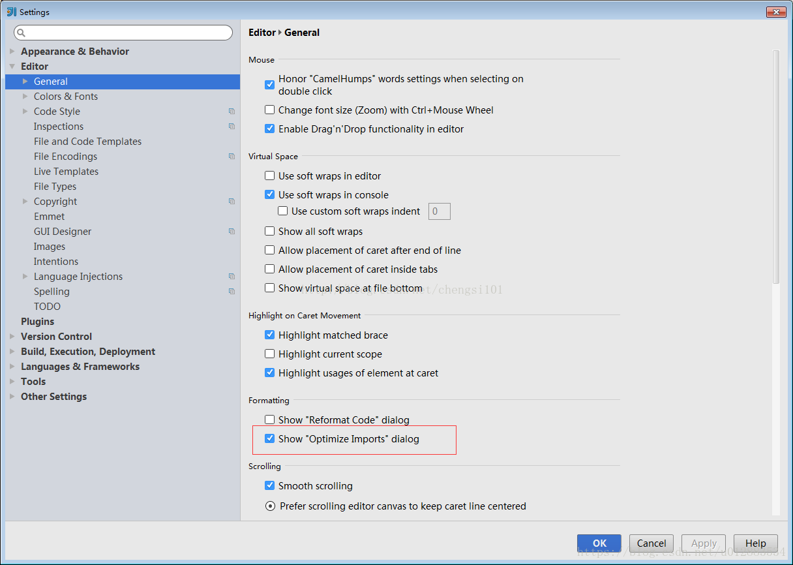
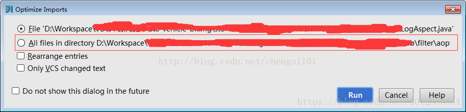

# IDEA 设置

<!-- TOC -->

- [IDEA 设置](#idea-设置)
  - [设置代码提示和自动补全功能](#设置代码提示和自动补全功能)
  - [默认编码](#默认编码)
  - [Code Templates](#code-templates)
  - [粘贴多行代码时，总是自动缩进](#粘贴多行代码时总是自动缩进)
  - [自动清除无效 import 和 清除无效 import 的快捷键](#自动清除无效-import-和-清除无效-import-的快捷键)
  - [插件](#插件)

<!-- /TOC -->

## 设置代码提示和自动补全功能

点击 文件菜单(File) –> 点击 设置(Settings… `Ctrl+Alt+S`), –> 打开设置对话框。在左侧的导航框中点击 KeyMap。 
接着在右边的树型框中选择 Main menu –> Code –> Completion. 
接着需要做两件事： 
1. 移除原来的Cycle Expand Word 的 `Alt+/` 快捷键绑定。 
2. 在 Basic 上点击右键,去除原来的 `Ctrl+空格` 绑定,然后添加 `Alt+/` 快捷键。

## 默认编码

1. File->Settings->Editor->File Encodings 这种方式修改的文件编码方式只对当前 project 起作用，每次新建了一个工程后还需要重新设置编码方式。
1. File->Other Settings->Default Settings->Editor->File Encodings ，这儿设置的是默认的文件编码方式，所有新建的工程使用的都是默认的文件编码方式。
1. `Create UTF-8 Files with BOM` 设置为 `with NO BOM` 。

## Code Templates

路径： `Sttings...` > `Editor` > `File and Code Templates` 

修改 `Includes` 下的 `File Header` 文件即可，内容如下：

``` java
/**
 *
 * @author stopper
 * @create ${YEAR}-${MONTH}-${DAY}
 */
```


## 粘贴多行代码时，总是自动缩进

`settings ->eidtor->smart keys -> reformat on paste  选择 NONE`

## 自动清除无效 import 和 清除无效 import 的快捷键

自动清除的配置方法: 

路径： `settings -> eidtor -> general -> auto import` 

 - 勾选`optimize imports on the fly (for current project)`，
  
在当前项目下会自动清除无效的import，而且这个是随时自动清除的。

**使用idea一次性清理所有java文件中多余导入未使用的包，首先ctrl+alt+s打开设置界面，红框中的位置打勾** 



点击ok后关闭，然后ctrl + alt + o弹出如下窗口：



红框中的意思为某目录下所有文件，选中后run即可


## 插件

- Grep Console 日志高亮
- Alibaba Cloud Toolkit 一键开发部署
- Statistic 代码统计
- Free Mybatis plugin 
- IntelliJ Lombok plugin
- Alibaba Cloud Toolkit 
- Builder Generator
- Gitmoji
- CamelCase 驼峰转换
- MyBatisCodeHelperPro 

字节码

- jclasslib Bytecode viewer  字节码
- Bytecode Viewer